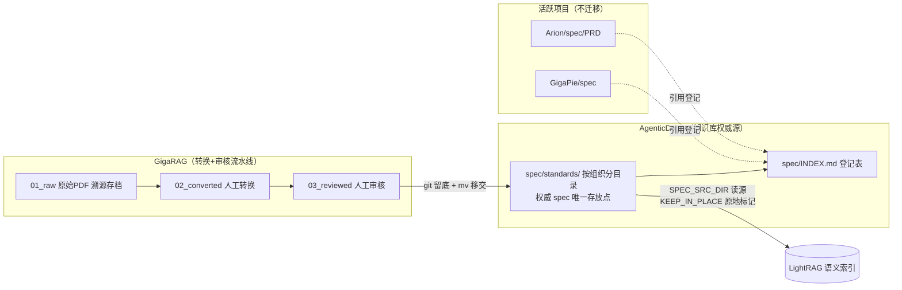

# spec 集中目录建立 执行计划

> **执行方式**：推荐使用 subagent-driven-development 或 executing-plans
> **调研说明**：调研降级为 WebSearch 快速调研（docs-as-code 拓扑、StrictDoc/Doorstop 目录约定），未运行完整 it.deepresearch 流程。
> **修订 v1.1（2026-09-16 用户指令：所有 spec 文件与 idea 保存在 ./spec）**：新增 `spec/idea/` 类目；`Notes/idea/` 与 `idea/` 归位 `spec/idea/`（A8 修订，Task 3 Step 3 承担）；`docs/plans/` 存放执行计划（plan 类，非 spec/idea），保留原位。

| I need to... | § |
|---|---|
| 看目标/架构/KPI | Header |
| 看方案为什么选 C | 方案选型 |
| 建仓库骨架 | Task 1 |
| GigaRAG 留底 | Task 2 |
| 迁移规范与 idea 归位 | Task 3 |
| 改 ingest.sh | Task 4 |
| 端到端验证 | Task 5 |

**目标**：在 AgenticDocer 建立 `spec/` 作为芯片设计知识库的集中权威目录——所有 spec 文件与 idea 文档统一归档于此（用户指令 2026-09-16）：首批物理集中 GigaRAG 已审核的 7 份行业规范，idea 文档（立项方案/假设/评审记录）归位 `spec/idea/`，并为活跃项目的工程 spec 建立引用登记机制。

**架构**：AgenticDocer（本仓库）= 知识库权威源，`spec/` 按 v0.1 方案的文档类型分类存放 spec；GigaRAG 回归纯转换流水线（01_raw→02_converted→03_reviewed→移交）；LightRAG 摄入改为从 `spec/` 读源，导入状态以 frontmatter `ingested_at` 原地标记，权威文件永不移动。

**技术栈**：bash（git/mv/find）、Markdown + YAML frontmatter（mySkills meta-fields v1.1）、Python 3 标准库（frontmatter 升级脚本，零第三方依赖）、GigaRAG ingest.sh（现有脚本参数化）。

**背景输入**：`Notes/idea/芯片设计知识库-结构化文档方案-v0.1.md`（分类体系与字段依据）；假设记录 `idea/assumptions.md`（A1–A13）。

**现状基线**（2026-09-16 探明）：

- AgenticDocer 无 git，仅 `Notes/idea/` 下 1 份方案文档
- GigaRAG `corpus/03_reviewed/` 有 7 份已审核行业规范（约 11.4MB），**均未被 git 跟踪**
- `scripts/ingest.sh`（145 行）：L14 `REVIEWED_DIR` 硬编码平铺路径；L53 `find -maxdepth 1`；L134 导入成功后 `mv` 至 04_ingested；`add_ingested_at()` 幂等追加已存在
- 7 份规范：PCIe 5.0（PCI-SIG）、CXL r3.2（CXL Consortium）、JESD270-4A HBM4（JEDEC）、AMBA AHB IHI0033C / AHB-Lite IHI0033B / APB IHI0024 / AXI-ACE IHI0022K（ARM）

**架构总览**：



**KPI（可量化验收）**：

| # | 指标 | 目标 | 验证方式 |
|---|---|---|---|
| K1 | GigaRAG reviewed 行业规范集中率 | 7/7 = 100% | `find spec/standards -name '*.md' -type f \| wc -l` = 7 |
| K2 | frontmatter 必填字段完整率 | 7 份 × 17 字段 = 100%（ingested_at 不计入：本计划不执行摄入，A10） | Task 5 Step 1 输出缺失总数 0 |
| K3 | ingest.sh 对 spec/ 读源可用 | `SPEC_SRC_DIR=…/spec/standards DRY_RUN=1` 列出恰好 7 份 | Task 5 |
| K4 | INDEX 登记完整 | 物理表 7 行 + 引用表 ≥3 行；表 1 路径与 frontmatter spec_id 逐条一致；引用路径存在率 100% | Task 5 Step 2 |
| K5 | 可恢复性 | 迁移前 GigaRAG commit 留底；AgenticDocer 全程 git 跟踪 | `git log` 双仓可见 |
| K6 | 零删除 | 全程仅 mv/cp，无任何 rm | 执行记录审查 |

**方案选型**：

| 方案 | 核心思路 | 结果 |
|---|---|---|
| A 全物理集中 | 所有项目 spec 一律迁入 spec/ | 否决——破坏 GigaPie/Arion 活跃流水线（it.* 工具按项目内路径读写） |
| B 纯引用集中 | 零迁移，仅 INDEX 登记 | 否决——权威分散，7 份已审核规范仍埋在语料流水线目录，知识库无权威源 |
| C 分层集中 | 知识库型 spec 物理集中（v0.1 §9 试点范围）+ 工程型 spec 引用登记，归档时棘轮晋升 | **采用**。对齐试点声明、零破坏、晋升只改 INDEX 条目 |

**实施顺序**：

**Phase 1: 权威源仓库就绪**
- Task 1: 仓库初始化 + spec/ 骨架 - 优先级：高 - 依赖：无

**Phase 2: 首批集中迁移**
- Task 2: GigaRAG 留底提交 - 优先级：高 - 依赖：无（与 Task 1 可并行）
- Task 3: 迁移 7 份规范 + frontmatter 升级 - 优先级：高 - 依赖：Task 1、Task 2

**Phase 3: 流水线适配**
- Task 4: ingest.sh 读源参数化 + GigaRAG 文档同步 - 优先级：中 - 依赖：Task 3

**Phase 4: 登记与验证**
- Task 5: 外部引用核对 + 端到端断言 - 优先级：低 - 依赖：Task 4

**关键依赖路径**：Task 2 → Task 3 → Task 4 → Task 5
**并行可能性**：Task 1 与 Task 2 无相互依赖，可并行。

---

### Task 1: 仓库初始化 + spec/ 骨架

**Context brief**：
- 本 task 建立知识库权威源仓库的地基：git 仓库、spec/ 目录规范文档、登记索引、frontmatter 升级脚本
- 消费上游：无（首个 task）
- 产出下游：Task 3 依赖本 task 的 `spec/standards/` 目录结构与 `scripts/upgrade_frontmatter.py`；Task 5 依赖 INDEX.md 存在
- 全局约束摘录：可恢复性原则（禁删，仅 mv）；AGENTS.md 强制 mySkills frontmatter 规范；不预建空类目目录（A7）

**Files**:
- Create: `.gitignore`
- Create: `spec/README.md`
- Create: `spec/INDEX.md`
- Create: `scripts/upgrade_frontmatter.py`

**Steps**:

- [ ] **Step 1: git 初始化并提交现有 Notes（迁移前留底）**

```bash
git -C /home/lxx/wrk/AgenticDocer init
git -C /home/lxx/wrk/AgenticDocer add Notes docs idea
git -C /home/lxx/wrk/AgenticDocer commit -m "docs: 立项方案 v0.1 + spec 集中目录执行计划与假设记录"
```

- [ ] **Step 2: 写 `.gitignore`**

```gitignore
# 工作区临时文件
temp/
*.tmp
*.bak
.DS_Store

# skill 本地状态
.skills_local/
idea/.logs/
```

- [ ] **Step 2b: 提交 `.gitignore`**（计划产物全程入库，K5/R2）

```bash
git -C /home/lxx/wrk/AgenticDocer add .gitignore
git -C /home/lxx/wrk/AgenticDocer commit -m "chore: gitignore"
```

- [ ] **Step 3: 写 `spec/README.md`**（完整内容）

````markdown
---
title: spec 目录规范
type: composite
purpose: spec
audience: both
direction: input
status: approved
version: "1.0.0"
section_meta: "@meta"
---

# spec/ — 芯片设计知识库 spec 集中目录

本仓库（AgenticDocer）是芯片设计知识库的 **spec 权威源**；`spec/` 是所有 spec 文档与 idea 文档的唯一集中存放点。设计依据：`idea/芯片设计知识库-结构化文档方案-v0.1.md`（下称 v0.1 方案；自 `Notes/idea/` 归位）。

## 目录分类（对齐 v0.1 §1 文档类型）

| 子目录 | 内容 | 状态 |
|---|---|---|
| `standards/<org>/` | 标准组织正式规范：PCIe/AMBA/CXL/JEDEC/UCIe/IEEE 1800 LRM/RISC ISA 等 | 已建（首批 7 份） |
| `lang/` | 语言/脚本语法手册：EDA 厂商 TCL 方言命令参考、工具语法手册等非标准组织出版物 | 定义即建（首份文档移交时创建） |
| `product/` | 内部产品 spec：PRD/架构 spec/MAS/接口规格等 | 同上 |
| `safety/` | 功能安全分析：FMEA/FTA/认证合规 | 同上 |
| `idea/` | idea 文档：立项方案、假设记录（assumptions）、对抗评审记录（.review）；it-idea 产物默认落此目录 | 已建（首批：v0.1 方案、本计划假设与评审记录） |

边界细则（假设 A12）：标准组织（PCI-SIG/ARM/JEDEC/CXL/UCIe/IEEE/RISC-V International）发布的正式规范入 `standards/`；EDA 厂商的语法参考/教程手册入 `lang/`。

## 命名规范

- 文件名保持来源惯例（如 `IHI0022K_AMBA_AXI_ACE_protocol_spec.md`）；新增文档建议 `<来源编号或协议名>.md`
- **basename 全局唯一**（硬约束：ingest.sh 按 basename 与 lightRAG 核对结果）
- 文件级稳定 ID：`SPEC-<类>-<名称>-<版本>`，登记于 frontmatter `spec_id` 与 `INDEX.md`

## frontmatter 规范（v2）

mySkills 文档元数据（AGENTS.md 强制）+ spec 专属字段 + GigaRAG 流水线溯源字段：

```yaml
---
# --- mySkills 文档元数据（必填）---
title: PCI Express Base Specification Revision 5.0 Version 1.0
type: composite            # 固定
purpose: spec              # 固定
audience: both
direction: input           # 知识库供 LLM 检索消费
status: approved           # approved=审核通过采信；review=已迁移但缺 reviewed_by；draft=转换完成未审核（不应出现在 spec/）
version: "1.0.0"           # 本仓库元数据版本（非规范版本）
section_meta: "@meta"      # 固定
# --- spec 专属字段（必填）---
spec_id: SPEC-STD-PCIE-5.0
spec_type: standard        # standard | lang | tool-manual | product | safety
spec_org: PCI-SIG          # 制定组织
spec_revision: "5.0 v1.0"  # 原始规范版本号
# --- 流水线溯源（GigaRAG 移交时必须已存在）---
source: corpus/01_raw/specifications/pcie/PCI_Express_Base_Specification_Revision_5.0.pdf
converted_by: mineru
converted_at: 2026-08-31
reviewed_by: lxx
reviewed_at: 2026-08-31
# --- 导入标记（ingest.sh 幂等追加，勿手工写）---
ingested_at: 2026-09-16
---
```

| 字段 | 必填 | 说明 |
|---|---|---|
| mySkills 八项（title/type/purpose/audience/direction/status/version/section_meta） | 是 | 见 `~/wrk/mySkills/docs/meta-fields-reference.md` §1 |
| spec_id / spec_type / spec_org / spec_revision | 是 | 参考 v0.1 §4.4 公共字段（id/version/status/source_ref）的文件级落地，spec_type/spec_org 为本目录新增扩展；条款级 URN 属后续结构化 DB（超本阶段范围） |
| source / converted_by / converted_at / reviewed_by / reviewed_at | 是 | GigaRAG 移交前置条件；`source` 指向 GigaRAG `corpus/01_raw/` 原始 PDF（假设 A4） |
| ingested_at | 导入后由脚本追加 | LightRAG 导入标记（幂等） |

## 移交流程（GigaRAG → spec/）

1. GigaRAG 内完成人工转换（`02_converted/`）与人工审核（`03_reviewed/`）——GigaRAG 工作流不变
2. GigaRAG 留底：`git -C ~/wrk/GigaRAG add corpus/03_reviewed && git -C ~/wrk/GigaRAG commit -m "chore(corpus): reviewed 留底（移交前存档）"`
3. `mv` 至 `spec/standards/<org>/`（org = 小写组织名：pcie/amba/cxl/jedec/ucie/ieee/…）
4. 补全 frontmatter v2 字段：`uv run --no-project python3 scripts/upgrade_frontmatter.py spec/standards/<org>/<file>.md`（脚本幂等；新文档需先在脚本 `REGISTRY` 登记三专属字段）
5. `spec/INDEX.md` 表 1 登记
6. `git add spec/ scripts/ && git commit`

## 与 LightRAG 的关系

- 摄入：`SPEC_SRC_DIR=$HOME/wrk/AgenticDocer/spec/standards KEEP_IN_PLACE=1 ~/wrk/GigaRAG/scripts/ingest.sh`（递归扫描；已带 `ingested_at` 的文件自动跳过防重复入库；`DRY_RUN=1` 仅列出待导入）
- **权威文件导入后不移动**：`KEEP_IN_PLACE=1` 时成功件原地追加 `ingested_at`；失败件保留原处
- 职责划分见 v0.1 §6：本目录=确定性权威源；LightRAG=渲染文本的语义索引，滞后无害
````

- [ ] **Step 4: 写 `spec/INDEX.md`**（完整内容）

````markdown
---
title: spec 登记索引
type: composite
purpose: readme
audience: both
direction: input
status: approved
version: "1.0.0"
section_meta: "@meta"
---

# spec 登记索引

`spec/` 内容的两张登记表：表 1 = 物理集中的权威文档；表 2 = 活跃项目工程 spec 的引用登记（不迁移，归档时晋升为表 1 条目）。

## 表 1：物理集中文档（7）

| spec_id | 路径（相对 spec/） | spec_type | spec_org | 规范版本 | status | 原始来源（GigaRAG） |
|---|---|---|---|---|---|---|
| SPEC-STD-PCIE-5.0 | standards/pcie/PCI_Express_Base_Specification_Revision_5.0.md | standard | PCI-SIG | 5.0 v1.0 | approved | corpus/01_raw/specifications/pcie/ |
| SPEC-STD-CXL-3.2 | standards/cxl/CXL_Specification_rev3p2_ver1p0.md | standard | CXL Consortium | r3.2 v1.0 | approved | corpus/01_raw/specifications/cxl/ |
| SPEC-STD-HBM4-JESD270-4A | standards/jedec/JEDEC_JESD270-4A_HBM4_2025.md | standard | JEDEC | JESD270-4A | approved | corpus/01_raw/specifications/hbm/ |
| SPEC-STD-AMBA-AHB-C | standards/amba/IHI0033C_AMBA_AHB_spec.md | standard | ARM | IHI0033C | approved | corpus/01_raw/specifications/amba/ |
| SPEC-STD-AMBA-AHB-LITE-B | standards/amba/IHI0033B_AMBA5_AHB_AHB-Lite_spec.md | standard | ARM | IHI0033B | approved | corpus/01_raw/specifications/amba/ |
| SPEC-STD-AMBA-APB | standards/amba/IHI0024_AMBA_APB_spec.md | standard | ARM | IHI0024 | approved | corpus/01_raw/specifications/amba/ |
| SPEC-STD-AMBA-AXI-K | standards/amba/IHI0022K_AMBA_AXI_ACE_protocol_spec.md | standard | ARM | IHI0022K | approved | corpus/01_raw/specifications/amba/ |

> 原始来源子目录名以各文件 frontmatter `source` 字段为准（迁移时原样保留，不作猜测改写）。

## 表 2：外部工程 spec 引用登记（3）

| 引用 ID | 项目路径 | 内容 | 类型 | 项目状态 |
|---|---|---|---|---|
| REF-GIGAPIE-SPEC | ~/wrk/GigaPie/spec/ | 工程流水线 spec：arch_spec/ impl_spec/ test_plan/ checklist/ | product | active |
| REF-ARION-PRD | ~/wrk/Arion/spec/PRD/ | 芯片 PRD：Arion_IODie_PRD.md、IO扩展芯粒整体设计方案（2 个 md 版本，另 docx/drawio 源件） | product | active |
| REF-NOVA-ARCHEXPLORER | ~/wrk/nova2026/archExplorer/spec/ | 芯片设计模拟器 spec（含 archive/ 归档） | product | active |

## 维护规则

- 新增物理集中文档：先 `spec/README.md` 移交流程，后本表 1 加行
- 引用晋升：项目归档时把表 2 行 mv 入 spec/ 并改写为表 1 行（棘轮单向，不降级）
````

- [ ] **Step 5: 写 `scripts/upgrade_frontmatter.py`**（完整内容，零第三方依赖）

```python
#!/usr/bin/env python3
"""为 spec frontmatter 补全 mySkills 与 spec 专属字段（幂等）。

用法: uv run --no-project python3 scripts/upgrade_frontmatter.py <md文件...>
行为: 仅追加缺失字段，绝不改写已有字段；无 frontmatter 的文件报错退出。
status 判定（假设 A13）: frontmatter 已有 reviewed_by -> approved，否则 review。
新文档接入: 在 REGISTRY 登记其 spec_id/spec_org/spec_revision 三专属字段。
"""
import re
import sys
from pathlib import Path

COMMON_FIELDS = [
    ("type", "composite"),
    ("purpose", "spec"),
    ("audience", "both"),
    ("direction", "input"),
    ("version", '"1.0.0"'),
    ("section_meta", '"@meta"'),
    ("spec_type", "standard"),
]

# spec 专属字段登记表（Task 3 首批 7 份；增量文档在此追加）
REGISTRY = {
    "PCI_Express_Base_Specification_Revision_5.0.md": {
        "spec_id": "SPEC-STD-PCIE-5.0", "spec_org": "PCI-SIG", "spec_revision": '"5.0 v1.0"',
    },
    "CXL_Specification_rev3p2_ver1p0.md": {
        "spec_id": "SPEC-STD-CXL-3.2", "spec_org": "CXL Consortium", "spec_revision": '"r3.2 v1.0"',
    },
    "JEDEC_JESD270-4A_HBM4_2025.md": {
        "spec_id": "SPEC-STD-HBM4-JESD270-4A", "spec_org": "JEDEC", "spec_revision": "JESD270-4A",
    },
    "IHI0033C_AMBA_AHB_spec.md": {
        "spec_id": "SPEC-STD-AMBA-AHB-C", "spec_org": "ARM", "spec_revision": "IHI0033C",
    },
    "IHI0033B_AMBA5_AHB_AHB-Lite_spec.md": {
        "spec_id": "SPEC-STD-AMBA-AHB-LITE-B", "spec_org": "ARM", "spec_revision": "IHI0033B",
    },
    "IHI0024_AMBA_APB_spec.md": {
        "spec_id": "SPEC-STD-AMBA-APB", "spec_org": "ARM", "spec_revision": "IHI0024",
    },
    "IHI0022K_AMBA_AXI_ACE_protocol_spec.md": {
        "spec_id": "SPEC-STD-AMBA-AXI-K", "spec_org": "ARM", "spec_revision": "IHI0022K",
    },
}

FM_RE = re.compile(r"^---\n(.*?)\n---\n", re.DOTALL)


def upgrade(path: Path) -> None:
    text = path.read_text(encoding="utf-8")
    m = FM_RE.match(text)
    if not m:
        sys.exit(f"[err] 无 frontmatter: {path}")
    fm = m.group(1)
    existing = {ln.split(":", 1)[0].strip() for ln in fm.splitlines() if ":" in ln}
    add = list(COMMON_FIELDS) + [
        (k, v) for k, v in REGISTRY.get(path.name, {}).items()
        if k not in existing
    ]
    # spec_id 缺失且未登记 -> 报错（不猜测）
    if "spec_id" not in existing and "spec_id" not in {k for k, _ in add}:
        sys.exit(f"[err] {path.name} 未在 REGISTRY 登记 spec_id/spec_org/spec_revision")
    # status 按溯源判定（A13）：已有字段则跳过，缺失时按 reviewed_by 推导
    if "status" not in existing:
        add.append(("status", "approved" if "reviewed_by" in existing else "review"))
    missing = [(k, v) for k, v in add if k not in existing]
    if not missing:
        print(f"[skip] {path.name}: 字段齐全")
        return
    new_fm = fm + "\n" + "\n".join(f"{k}: {v}" for k, v in missing)
    new_text = "---\n" + new_fm + "\n---\n" + text[m.end():]
    path.write_text(new_text, encoding="utf-8")
    print(f"[ok] {path.name}: +{len(missing)} 字段 ({', '.join(k for k, _ in missing)})")


if __name__ == "__main__":
    if len(sys.argv) < 2:
        sys.exit(__doc__)
    for arg in sys.argv[1:]:
        upgrade(Path(arg))
```

**Exit criteria**:
- [ ] `git log --oneline` 有 2 条提交（立项 + gitignore）；`spec/README.md`、`spec/INDEX.md`、`scripts/upgrade_frontmatter.py` 3 个新文件在位，待 Task 3 提交
- [ ] `spec/README.md`、`spec/INDEX.md` 无 TODO/TBD/待定 占位符
- [ ] `python3 -m py_compile scripts/upgrade_frontmatter.py` 通过

**Verification commands**:
```bash
git -C /home/lxx/wrk/AgenticDocer log --oneline
python3 -m py_compile /home/lxx/wrk/AgenticDocer/scripts/upgrade_frontmatter.py
```

---

### Task 2: GigaRAG 留底提交

**Context brief**：
- 本 task 在迁移前把 7 份 reviewed spec 提交进 GigaRAG git 历史——它们当前未被跟踪，mv 后无任何版本兜底
- 消费上游：无
- 产出下游：Task 3 的 mv 依赖本 task 完成（可恢复性 K5）
- 全局约束摘录：禁止 `git reset`/删除；仅 add+commit

**Files**:
- Modify（git 索引）: `/home/lxx/wrk/GigaRAG/corpus/03_reviewed/`（7 份 .md 入库）

**Steps**:

- [ ] **Step 1: 提交留底**

```bash
git -C /home/lxx/wrk/GigaRAG add corpus/03_reviewed
git -C /home/lxx/wrk/GigaRAG commit -m "chore(corpus): reviewed specs 留底（移交 AgenticDocer/spec 前存档）"
```

**Exit criteria**:
- [ ] `git -C ~/wrk/GigaRAG ls-files corpus/03_reviewed` 列出 7 份 .md + README.md

**Verification commands**:
```bash
git -C /home/lxx/wrk/GigaRAG ls-files corpus/03_reviewed
```

---

### Task 3: 迁移 7 份规范 + idea 归位 + frontmatter 升级

**Context brief**：
- 本 task 执行物理集中：mv 7 份规范入 `spec/standards/<org>/` 并跑升级脚本补 frontmatter；同时把本仓库 idea 文档归位 `spec/idea/`（用户指令：所有 spec 与 idea 归档 ./spec）
- 消费上游：Task 1 的目录结构与脚本、Task 2 的 git 留底
- 产出下游：Task 4 的 ingest 读源以本 task 产物为输入；Task 5 断言 7 份存在
- 全局约束摘录：仅 mv 零删除（K6）；frontmatter `source` 等历史字段原样保留不改写；文件名不变（A6）

- Move: `~/wrk/GigaRAG/corpus/03_reviewed/*.md` → `spec/standards/{pcie,cxl,jedec,amba}/`
- Move: `Notes/idea/*.md` → `spec/idea/`；`idea/assumptions.md`、`idea/.review/` → `spec/idea/`（A8 修订）
- Modify: 迁移的 7 份规范 frontmatter（仅追加缺失字段）

**Steps**:

- [ ] **Step 1: 建目录并迁移**

```bash
mkdir -p /home/lxx/wrk/AgenticDocer/spec/standards/{pcie,cxl,jedec,amba}
mv /home/lxx/wrk/GigaRAG/corpus/03_reviewed/PCI_Express_Base_Specification_Revision_5.0.md /home/lxx/wrk/AgenticDocer/spec/standards/pcie/
mv /home/lxx/wrk/GigaRAG/corpus/03_reviewed/CXL_Specification_rev3p2_ver1p0.md /home/lxx/wrk/AgenticDocer/spec/standards/cxl/
mv /home/lxx/wrk/GigaRAG/corpus/03_reviewed/JEDEC_JESD270-4A_HBM4_2025.md /home/lxx/wrk/AgenticDocer/spec/standards/jedec/
mv /home/lxx/wrk/GigaRAG/corpus/03_reviewed/IHI0033C_AMBA_AHB_spec.md \
   /home/lxx/wrk/GigaRAG/corpus/03_reviewed/IHI0033B_AMBA5_AHB_AHB-Lite_spec.md \
   /home/lxx/wrk/GigaRAG/corpus/03_reviewed/IHI0024_AMBA_APB_spec.md \
   /home/lxx/wrk/GigaRAG/corpus/03_reviewed/IHI0022K_AMBA_AXI_ACE_protocol_spec.md \
   /home/lxx/wrk/AgenticDocer/spec/standards/amba/
```

- [ ] **Step 2: frontmatter 升级（幂等脚本，跑两遍验证幂等）**

```bash
cd 前 无需；指定绝对路径执行:
uv run --no-project python3 /home/lxx/wrk/AgenticDocer/scripts/upgrade_frontmatter.py \
  /home/lxx/wrk/AgenticDocer/spec/standards/*/*.md
uv run --no-project python3 /home/lxx/wrk/AgenticDocer/scripts/upgrade_frontmatter.py \
  /home/lxx/wrk/AgenticDocer/spec/standards/*/*.md   # 第二遍应全部 [skip]
```

- [ ] **Step 3: 仓库内 idea 归位 `spec/idea/`**（用户指令 2026-09-16；A8 修订）

```bash
mkdir -p /home/lxx/wrk/AgenticDocer/spec/idea
mv /home/lxx/wrk/AgenticDocer/Notes/idea/芯片设计知识库-结构化文档方案-v0.1.md /home/lxx/wrk/AgenticDocer/spec/idea/
mv /home/lxx/wrk/AgenticDocer/idea/assumptions.md /home/lxx/wrk/AgenticDocer/spec/idea/
mv /home/lxx/wrk/AgenticDocer/idea/.review /home/lxx/wrk/AgenticDocer/spec/idea/.review
rmdir /home/lxx/wrk/AgenticDocer/Notes/idea /home/lxx/wrk/AgenticDocer/Notes   # 仅删空目录，文件已全部 mv
```

- [ ] **Step 4: 提交（含 idea 归位与 Notes 退役）**

```bash
git -C /home/lxx/wrk/AgenticDocer add -A
git -C /home/lxx/wrk/AgenticDocer commit -m "feat(spec): 集中 7 份行业规范 + idea 归位 spec/idea + frontmatter v2"
```

**Exit criteria**:
- [ ] `find spec/standards -name '*.md' | wc -l` = 7（K1）
- [ ] `ls ~/wrk/GigaRAG/corpus/03_reviewed/` 仅剩 README.md
- [ ] 17 项必填字段零缺失（断言见 Task 5 Step 1）
- [ ] 第二遍脚本全部 `[skip]`（幂等）
- [ ] `test -f spec/idea/芯片设计知识库-结构化文档方案-v0.1.md && test -f spec/idea/assumptions.md && test -d spec/idea/.review`，且 `Notes/` 目录不存在

**Verification commands**:
```bash
find /home/lxx/wrk/AgenticDocer/spec/standards -name '*.md' -type f | wc -l
```

---

### Task 4: ingest.sh 读源参数化 + GigaRAG 文档同步

**Context brief**：
- 本 task 让 GigaRAG ingest.sh 支持从外部权威源（spec/standards，含子目录）读源且不移动权威文件；默认行为完全不变（03_reviewed 平铺 + mv 归档）
- 消费上游：Task 3 的 spec/ 目录
- 产出下游：Task 5 的 DRY_RUN 验证；未来 lightRAG 摄入操作
- 全局约束摘录：改 GigaRAG 前该仓库已 git 留底（Task 2 覆盖 corpus，脚本改动再单独 commit）；默认路径行为向后兼容

**Files**:
- Modify: `/home/lxx/wrk/GigaRAG/scripts/ingest.sh`（5 处）
- Modify: `/home/lxx/wrk/GigaRAG/README.md`（工作流步骤 4）
- Modify: `/home/lxx/wrk/GigaRAG/corpus/03_reviewed/README.md`（移交通道说明）
- Modify: `/home/lxx/wrk/GigaRAG/scripts/README.md`（新增环境变量说明段）

**Steps**:

- [ ] **Step 1: ingest.sh 修改 1/5 —— 配置段**（原 L13-16）

```bash
# 原:
REVIEWED_DIR="$REPO_ROOT/corpus/03_reviewed"
INGESTED_DIR="$REPO_ROOT/corpus/04_ingested"
TODAY="$(date +%F)"
# 改为:
SRC_DIR="${SPEC_SRC_DIR:-$REPO_ROOT/corpus/03_reviewed}"   # 读源目录；外部权威源时配 KEEP_IN_PLACE=1
INGESTED_DIR="$REPO_ROOT/corpus/04_ingested"               # 仅默认流水线模式（KEEP_IN_PLACE=0）的成功件归档处
KEEP_IN_PLACE="${KEEP_IN_PLACE:-0}"                        # 1=导入成功后原地标记 ingested_at，不移动（权威源模式）
DRY_RUN="${DRY_RUN:-0}"                                    # 1=仅列出待导入文件后退出
TODAY="$(date +%F)"
```

- [ ] **Step 2: 修改 2/5 —— 收集段递归化 + ingested_at 防重过滤 + DRY_RUN 门**（原 L52-59）

```bash
# 原:
mapfile -t FILES < <(find "$REVIEWED_DIR" -maxdepth 1 -name '*.md' -type f ! -name 'README.md' | sort)
if [ "${#FILES[@]}" -eq 0 ]; then
  log "03_reviewed 下无 markdown 文件，无需导入"
  exit 0
fi
log "待导入 ${#FILES[@]} 个文件:"
printf '  %s\n' "${FILES[@]}" | sed "s#$REVIEWED_DIR/##"
# 改为:
# 已带 ingested_at 的文件跳过：KEEP_IN_PLACE 权威源防重复入库（默认模式文件已 mv 走，天然不在读源目录）
mapfile -t FILES < <(find "$SRC_DIR" -name '*.md' -type f ! -name 'README.md' | sort | while IFS= read -r f; do grep -q '^ingested_at:' "$f" || printf '%s\n' "$f"; done)
if [ "${#FILES[@]}" -eq 0 ]; then
  log "$SRC_DIR 下无 markdown 文件，无需导入"
  exit 0
fi
log "待导入 ${#FILES[@]} 个文件:"
printf '  %s\n' "${FILES[@]}" | sed "s#$SRC_DIR/##"
if [ "$DRY_RUN" = "1" ]; then
  log "DRY_RUN=1，仅列出待导入文件，不执行导入"
  exit 0
fi
```

- [ ] **Step 3: 修改 3/5 —— 复制段记录全路径 + 读源内重名检查**（原 L77-86）

```bash
# 原:
copied=()
for f in "${FILES[@]}"; do
  base="$(basename "$f")"
  if [ -e "$LIGHTRAG_INPUT_DIR/$base" ]; then
    log "ERROR: inputs 目录已存在同名文件 $base，请先手动处理"
    exit 1
  fi
  cp "$f" "$LIGHTRAG_INPUT_DIR/$base"
  copied+=("$base")
done
# 改为:
declare -A SRC_BY_BASE=()
copied=()
for f in "${FILES[@]}"; do
  base="$(basename "$f")"
  if [ -n "${SRC_BY_BASE[$base]:-}" ]; then
    log "ERROR: 读源目录内 basename 重复: $base（${SRC_BY_BASE[$base]} 与 $f）"
    exit 1
  fi
  if [ -e "$LIGHTRAG_INPUT_DIR/$base" ]; then
    log "ERROR: inputs 目录已存在同名文件 $base，请先手动处理"
    exit 1
  fi
  cp "$f" "$LIGHTRAG_INPUT_DIR/$base"
  SRC_BY_BASE["$base"]="$f"
  copied+=("$base")
done
```

- [ ] **Step 4: 修改 4/5 —— 结果段按 basename 取源路径 + 原地标记分支**（原 L128-142）

```bash
# 原:
  src="$REVIEWED_DIR/$base"
  dst="$INGESTED_DIR/$base"
  if [ "$st" = "processed" ]; then
    mv "$src" "$dst"
    add_ingested_at "$dst" "$TODAY"
    log "OK   $base -> 04_ingested"
    ok=$((ok+1))
  else
    log "FAIL $base (状态: ${st:-未找到})，保留在 03_reviewed"
# 改为:
  src="${SRC_BY_BASE[$base]}"
  dst="$INGESTED_DIR/$base"
  if [ "$st" = "processed" ]; then
    if [ "$KEEP_IN_PLACE" = "1" ]; then
      add_ingested_at "$src" "$TODAY"
      log "OK   $base (原地标记 ingested_at=$TODAY)"
    else
      mv "$src" "$dst"
      add_ingested_at "$dst" "$TODAY"
      log "OK   $base -> 04_ingested"
    fi
    ok=$((ok+1))
  else
    log "FAIL $base (状态: ${st:-未找到})，保留在原处"
```

- [ ] **Step 5: 修改 5/5 —— 脚本头注释同步**（原 L2）

```bash
# 原:
# 将 corpus/03_reviewed/ 的 markdown 文档导入 lightRAG（HTTP API + /documents/scan）
# 改为:
# 将读源目录（默认 corpus/03_reviewed/，可 SPEC_SRC_DIR 指向 AgenticDocer/spec）的 markdown 导入 lightRAG
```

- [ ] **Step 6: `corpus/03_reviewed/README.md` 末尾追加**

```markdown
## 移交通道（2026-09 起）

已审核的行业规范文档移交 `~/wrk/AgenticDocer/spec/standards/` 集中管理（流程见该仓库 `spec/README.md`）；本目录仅存留转中的非规范类文档。lightRAG 导入改由 spec 侧驱动：`SPEC_SRC_DIR=$HOME/wrk/AgenticDocer/spec/standards KEEP_IN_PLACE=1 scripts/ingest.sh`。
```

- [ ] **Step 7: GigaRAG `README.md` 工作流步骤 4 替换**

```markdown
<!-- 原:
4. **导入**：运行 `scripts/ingest.sh` 将 `03_reviewed/` 推入 lightRAG，成功后移入 `04_ingested/`。
   改为: -->
4. **导入/移交**：行业规范类审核通过后移交 `~/wrk/AgenticDocer/spec/`（权威源，导入 lightRAG 用 `SPEC_SRC_DIR=<spec目录> KEEP_IN_PLACE=1 scripts/ingest.sh`，成功后原地标记不移动）；其余文档仍走 `scripts/ingest.sh` 默认流程（03_reviewed → 04_ingested）。
```

- [ ] **Step 8: `scripts/README.md` 末尾追加环境变量段**

```markdown
## ingest.sh 环境变量（2026-09 新增）

| 变量 | 默认 | 说明 |
|---|---|---|
| `SPEC_SRC_DIR` | `<repo>/corpus/03_reviewed` | 读源目录，支持子目录递归 |
| `KEEP_IN_PLACE` | `0` | `1`=导入成功后原地追加 ingested_at，不移动文件（外部权威源必开） |
| `DRY_RUN` | `0` | `1`=仅列出待导入文件后退出，不联网 |

已带 `ingested_at` 的文件自动跳过（防重复入库）；`DRY_RUN=1` 列出的即实际待导入集合。

典型用法（AgenticDocer spec 权威源）:
`SPEC_SRC_DIR=$HOME/wrk/AgenticDocer/spec/standards KEEP_IN_PLACE=1 scripts/ingest.sh`
```

- [ ] **Step 9: 提交 GigaRAG**

```bash
git -C /home/lxx/wrk/GigaRAG add scripts/ingest.sh README.md corpus/03_reviewed/README.md scripts/README.md
git -C /home/lxx/wrk/GigaRAG commit -m "feat(ingest): 读源参数化 SPEC_SRC_DIR + KEEP_IN_PLACE 原地标记（对接 AgenticDocer/spec 权威源）"
```

**Exit criteria**:
- [ ] `bash -n ingest.sh` 通过
- [ ] 默认行为回归：`DRY_RUN=1 bash ingest.sh`（不设 SPEC_SRC_DIR）在迁移后的空 03_reviewed 上输出"无 markdown 文件"退出 0
- [ ] spec 读源：`SPEC_SRC_DIR=$HOME/wrk/AgenticDocer/spec/standards DRY_RUN=1 bash ingest.sh` 列出恰好 7 份（K3）

**Verification commands**:
```bash
bash -n /home/lxx/wrk/GigaRAG/scripts/ingest.sh
SPEC_SRC_DIR=$HOME/wrk/AgenticDocer/spec/standards DRY_RUN=1 bash /home/lxx/wrk/GigaRAG/scripts/ingest.sh
DRY_RUN=1 bash /home/lxx/wrk/GigaRAG/scripts/ingest.sh
```

---

### Task 5: 外部引用核对 + 端到端断言

**Context brief**：
- 本 task 收口：核对 INDEX 表 2 引用路径真实存在，跑全量 KPI 断言
- 消费上游：Task 1–4 全部产物
- 产出下游：无（终态）
- 全局约束摘录：断言失败即报告，不静默降级

**Files**:
- Verify only: `spec/INDEX.md`、`spec/standards/**/*.md`、ingest.sh

**Steps**:

- [ ] **Step 1: frontmatter 完整性断言（K2）**

```bash
cd /home/lxx/wrk/AgenticDocer  # 或在各命令用绝对路径
shopt -s nullglob
files=(spec/standards/*/*.md)
test "${#files[@]}" -eq 7 || { echo "文件数 ${#files[@]} ≠ 7，中止"; exit 1; }   # 防 glob 空真通过
missing=0
for f in "${files[@]}"; do
  fm="$(awk 'NR==1{next} /^---[[:space:]]*$/{exit} {print}' "$f")"   # 仅断言 frontmatter 区
  for k in title type purpose audience direction status version section_meta \
           spec_id spec_type spec_org spec_revision source \
           converted_by converted_at reviewed_by reviewed_at; do
    printf '%s\n' "$fm" | grep -q "^${k}:" || { echo "MISSING: $k in $f"; missing=$((missing+1)); }
  done
done
echo "缺失总数: $missing"   # 期望 0
```

- [ ] **Step 2: 集中率与 INDEX 路径存在性断言（K1/K4）**

```bash
test "$(find /home/lxx/wrk/AgenticDocer/spec/standards -name '*.md' -type f | wc -l)" -eq 7 && echo "K1 OK"
while IFS='|' read -r sid path; do
  test -f "/home/lxx/wrk/AgenticDocer/spec/$path" || echo "K4 缺失: $sid -> $path"
  awk -v sid="$sid" 'NR==1{next} /^---[[:space:]]*$/{exit} $0 == "spec_id: " sid {found=1; exit} END{exit !found}' "/home/lxx/wrk/AgenticDocer/spec/$path" || echo "K4 ID 不一致: $sid"
done < <(awk -F'|' '/^\| SPEC-/ {sid=$2; path=$3; gsub(/^[ \t]+|[ \t]+$/, "", sid); gsub(/^[ \t]+|[ \t]+$/, "", path); print sid "|" path}' /home/lxx/wrk/AgenticDocer/spec/INDEX.md)
test -d /home/lxx/wrk/GigaRAG/corpus/01_raw/specifications && echo "K4 原始来源根 OK"
test -d /home/lxx/wrk/GigaPie/spec && echo "REF-GIGAPIE-SPEC OK"
test -d /home/lxx/wrk/Arion/spec/PRD && echo "REF-ARION-PRD OK"
test -d /home/lxx/wrk/nova2026/archExplorer/spec && echo "REF-NOVA-ARCHEXPLORER OK"
```
git -C /home/lxx/wrk/GigaRAG status --short -- README.md corpus/03_reviewed corpus/04_ingested scripts/ingest.sh scripts/README.md   # 精确到计划修改文件；scripts/convert 等 untracked 历史遗留不在判定内（R6）
- [ ] **Step 3: ingest 读源端到端（K3，复用 Task 4 命令）+ 双仓状态检查（K5）**

```bash
SPEC_SRC_DIR=$HOME/wrk/AgenticDocer/spec/standards DRY_RUN=1 bash /home/lxx/wrk/GigaRAG/scripts/ingest.sh
git -C /home/lxx/wrk/AgenticDocer status --short   # 期望为空：全部计划产物已入库（R2）
git -C /home/lxx/wrk/GigaRAG status --short -- scripts README.md corpus/03_reviewed corpus/04_ingested   # 仅判计划作用路径；02_converted 等计划外改动不判（R6）
```

**Exit criteria**:
- [ ] Step 1 输出 `缺失总数: 0`
- [ ] Step 2 无任何 K4 缺失/不一致输出；Step 3 DRY_RUN 列 7 份、两处 git status 均为空
- [ ] K6：全程执行记录中无 rm

**Verification commands**:
```bash
# 与 Steps 1-3 相同
```

---

## 风险与回退

| 风险 | 缓解 | 回退 |
|---|---|---|
| 迁移后 GigaRAG 其他脚本引用 03_reviewed 路径 | 已知消费者仅 ingest.sh（Task 4 适配）；`wait_and_ingest.sh`、`stage_unverified.py` 操作 03_unverified/02_converted，不受影响 | SPEC_SRC_DIR 指回任意目录 |
| lightRAG 内已有历史入库副本与迁移后 file_path 不一致 | 本计划不触发摄入（A10）；下次摄入前可用 `/documents` API 核对 | 按需删除 lightRAG 侧旧档后重导 |
| 个别规范缺 reviewed_by（评审实测 7/7 均有，防御性保留该分支） | 脚本自动降级 status=review 并在执行输出可见；同步将 INDEX 对应行 status 改为 review（与 A13 一致） | 补人工审核后改 approved |
| 3.4MB 大文件 frontmatter 写坏 | 脚本仅文本切片追加、双仓 git 兜底；失败文件可从 GigaRAG Task 2 提交恢复 | `git show HEAD:路径 > 文件` |

## 完成定义

K1–K6 全绿 + idea 归位完成 + 双仓提交历史完整 + 本文档无占位符。完成后知识库具备：唯一权威内容目录（spec + idea 统一于 `spec/`）、可信元数据、可运行的 lightRAG 摄入通道（实际摄入由用户择机执行，A10）。
