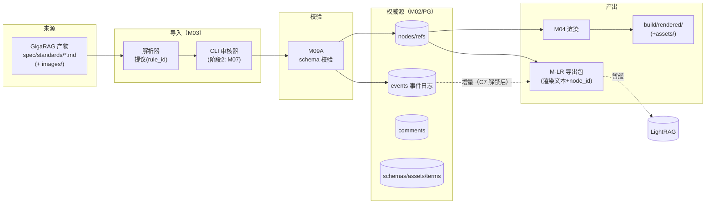
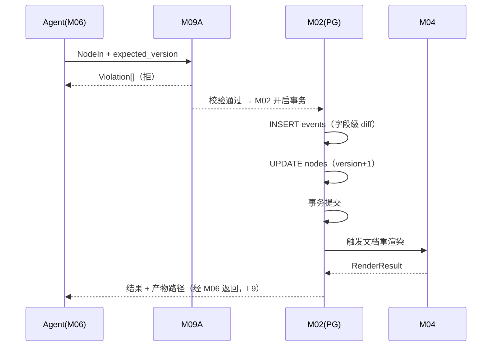
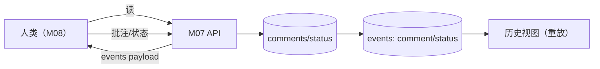
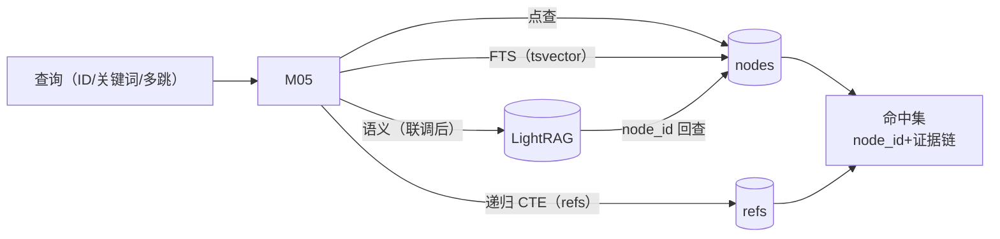

# 数据流向图

生成：2026-09-16（it.arch Phase 4）。模块编号见 `architecture_specification.md` §2。

## DF-1 系统级数据流（导入到消费）

## DF-2 写入路径（Agent 结构化写）

## DF-3 评审路径（人类）

## DF-4 检索路径

## 数据驻留与边界

| 数据 | 位置 | 生命周期 |
|---|---|---|
| 权威内容（nodes/refs/events/comments/schemas/assets/terms） | PG `agenticdocer` | 永久（append-only 事件） |
| 渲染产物 | `build/rendered/` | 可重建（派生） |
| 导入快照（源 markdown） | `spec/standards/` | 只读（勿编辑；改版经 M03 重导入） |
| LightRAG 索引 | 现：`/home/lxx/lightrag/rag_storage`（JSON）；迁移后：同 PG 实例 `LIGHTRAG_*` 表 | 派生（可重建） |
