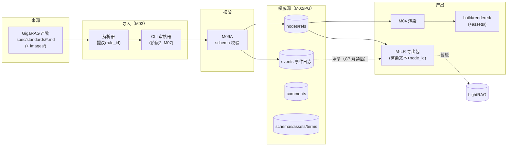
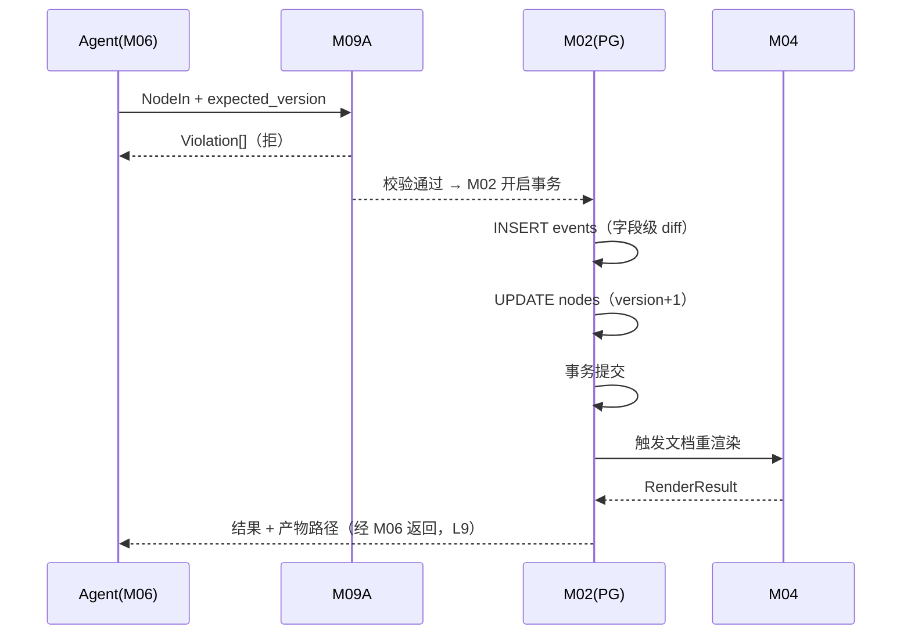
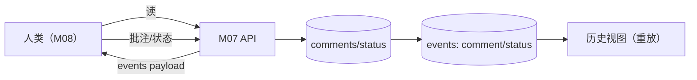
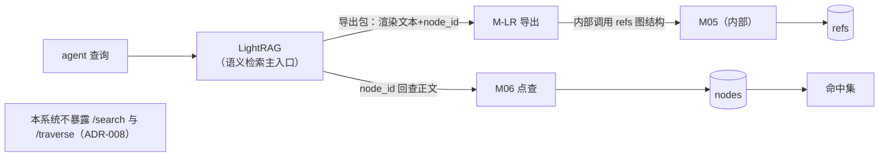
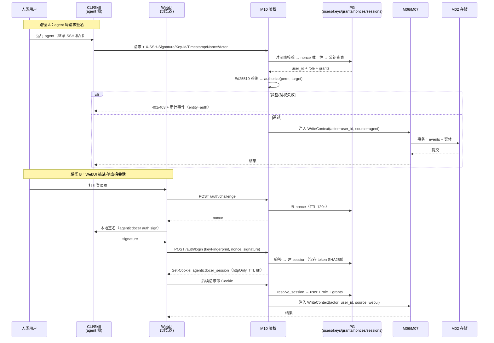

# 数据流向图

生成：2026-09-16（it.arch Phase 4）。模块编号见 `architecture_specification.md` §2。

## DF-1 系统级数据流（导入到消费）



## DF-2 写入路径（Agent 结构化写）



## DF-3 评审路径（人类）



## DF-4 检索路径（v1.3 收窄：B5/B8）



> **变更（B5/B8）**：原 DF-4 中「关键词检索 FTS」与「多跳遍历」的**公开入口已移除**；M05 降级为 M-LR 内部依赖。系统内检索能力：按 ID 直读（M06 点查）+ 文档树/章节树浏览（M06）；语义与关键词检索由 LightRAG 承担。

## DF-5 鉴权与写入链（v1.3 新增：B2/B3）



**鉴权审计流**：所有 401/403、用户/授权/密钥变更 → `events(entity='auth', op∈{login,logout,fail,user_change,grant_change,key_change})` → 供审计查询（不参与实体折叠）。
***```

## 数据驻留与边界

| 数据 | 位置 | 生命周期 |
|---|---|---|
| 权威内容（nodes/refs/events/comments/schemas/assets/terms/docs/**users/ssh_keys/grants/sessions/nonces**） | PG `agenticdocer`（nodes 按 doc_id HASH 64 分区；events 按 ts 月分区） | 永久（append-only 事件；events 分区 >24 月归档）；nonces TTL 300s、sessions TTL 8h |
| 渲染产物 | `build/rendered/`（含 `sections/<anchor>.md`） | 可重建（派生） |
| 导入快照（源 markdown） | `spec/standards/` | 只读（勿编辑；改版经 M03 重导入） |
| LightRAG 索引 | 现：`/home/lxx/lightrag/rag_storage`（JSON）；迁移后：同 PG 实例 `LIGHTRAG_*` 表 | 派生（可重建） |
| **SSH 公钥（管理员自举）** | `data/admin_keys/admin.pub`（gitignore） | 部署期输入；入库后以 DB 为准 |
| **SSH 私钥** | 用户 `~/.ssh/`（**系统从不持有**） | 由用户自行管理 |
