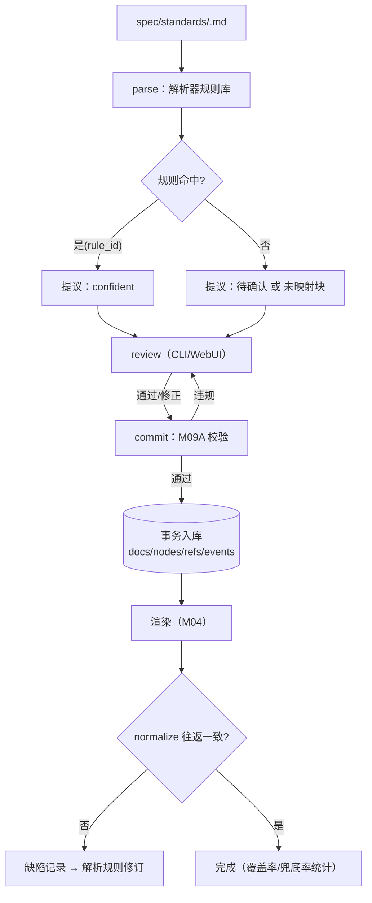
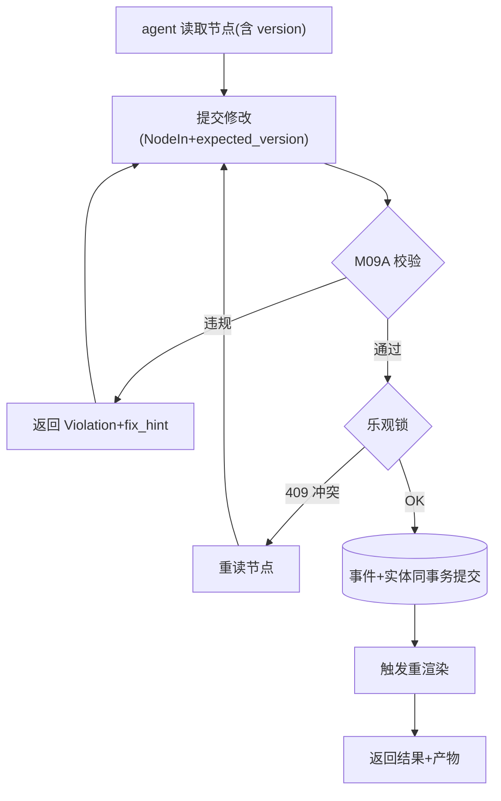
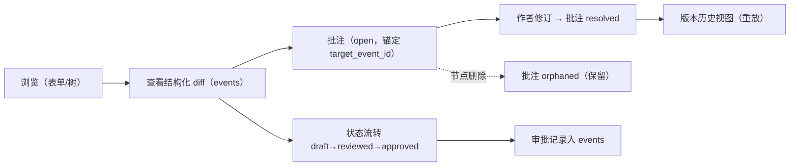
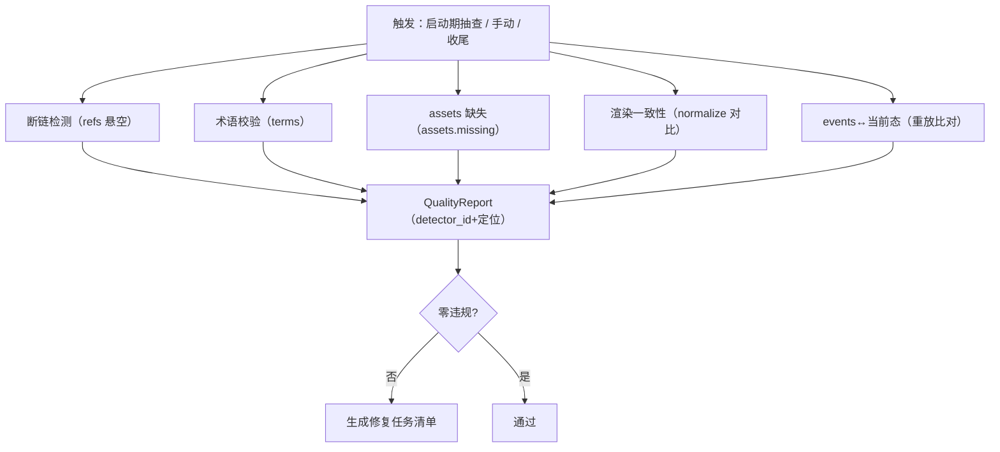
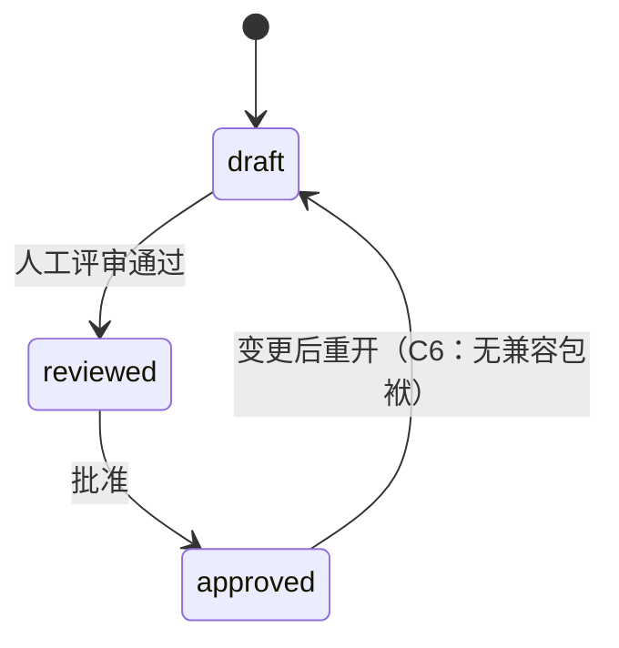

# 工作流程图

生成：2026-09-16（it.arch Phase 4）。

## WF-1 导入审核工作流（M03，半自动）

```mermaid
flowchart TD
    A["spec/standards/<doc>.md"] --> B["parse：解析器规则库"]
    B --> C{"规则命中?"}
    C -->|"是(rule_id)"| D["提议：confident"]
    C -->|"否"| E["提议：待确认 或 未映射块"]
    D --> F["review（CLI/WebUI）"]
    E --> F
    F -->|"通过/修正"| G["commit：M09A 校验"]
    G -->|"违规"| F
    G -->|"通过"| H[("事务入库<br/>docs/nodes/refs/events")]
    H --> I["渲染（M04）"]
    I --> J{"normalize 往返一致?"}
    J -->|"否"| K["缺陷记录 → 解析规则修订"]
    J -->|"是"| L["完成（覆盖率/兜底率统计）"]
```

## WF-2 Agent 修改工作流（含冲突重试与自修复）

```mermaid
flowchart TD
    A["agent 读取节点(含 version)"] --> B["提交修改(NodeIn+expected_version)"]
    B --> C{"M09A 校验"}
    C -->|"违规"| D["返回 Violation+fix_hint"]
    D --> B
    C -->|"通过"| E{"乐观锁"}
    E -->|"409 冲突"| F["重读节点"] --> B
    E -->|"OK"| G[("事件+实体同事务提交")]
    G --> H["触发重渲染"] --> I["返回结果+产物"]
```

## WF-3 评审工作流（人类，WebUI）

```mermaid
flowchart LR
    A["浏览（表单/树）"] --> B["查看结构化 diff（events）"]
    B --> C["批注（open，锚定 target_event_id）"]
    C --> D["作者修订 → 批注 resolved"]
    B --> E["状态流转 draft→reviewed→approved"]
    E --> F["审批记录入 events"]
    D --> G["版本历史视图（重放）"]
    C -. "节点删除" .-> H["批注 orphaned（保留）"]
```

## WF-4 质量门巡检（M09B，阶段 3）

```mermaid
flowchart TD
    T["触发：启动期抽查 / 手动 / 收尾"] --> D1["断链检测（refs 悬空）"]
    T --> D2["术语校验（terms）"]
    T --> D3["assets 缺失（assets.missing）"]
    T --> D4["渲染一致性（normalize 对比）"]
    T --> D5["events↔当前态（重放比对）"]
    D1 & D2 & D3 & D4 & D5 --> R["QualityReport（detector_id+定位）"]
    R --> G{"零违规?"}
    G -->|"否"| F["生成修复任务清单"]
    G -->|"是"| OK["通过"]
```

## 状态机（文档状态）

```mermaid
stateDiagram-v2
    [*] --> draft
    draft --> reviewed: 人工评审通过
    reviewed --> approved: 批准
    approved --> draft: 变更后重开（C6：无兼容包袱）
```
