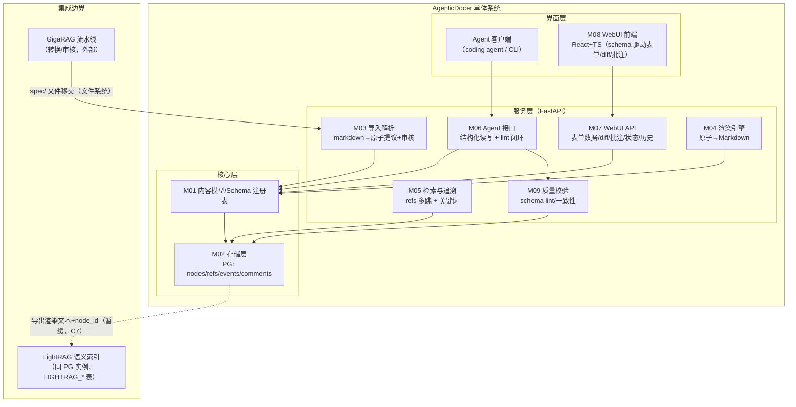
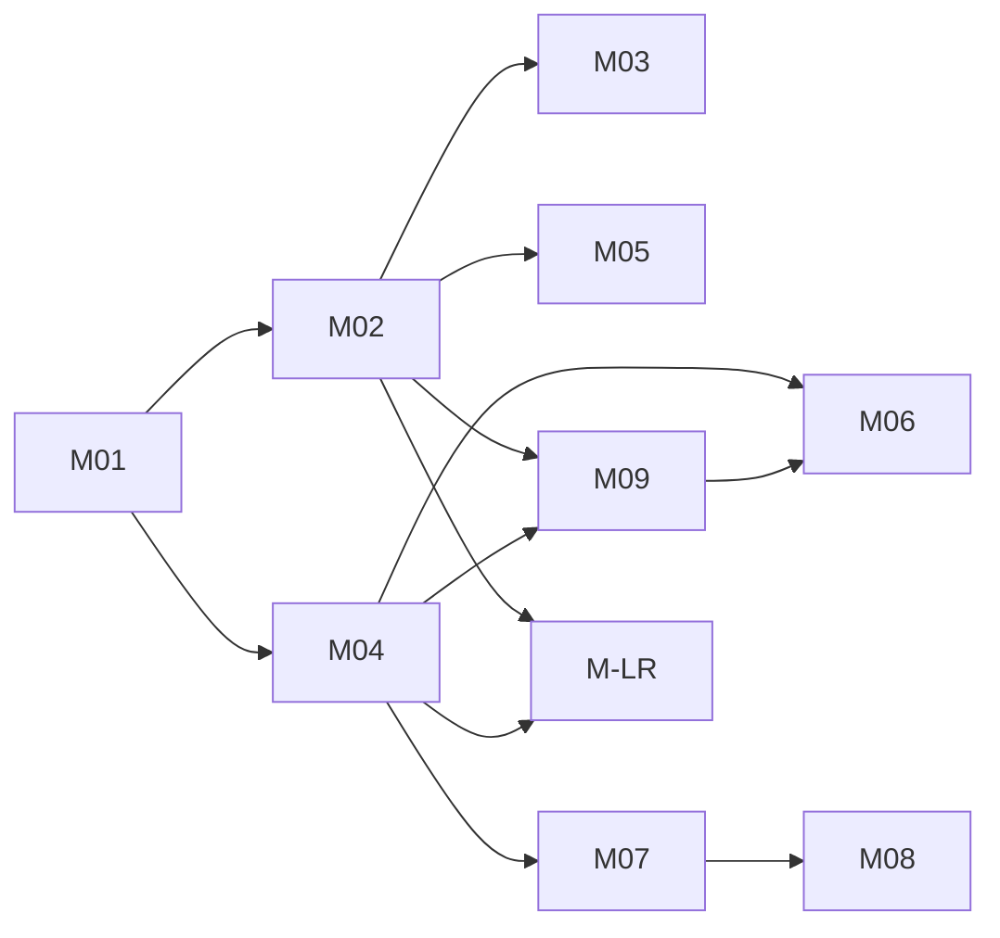
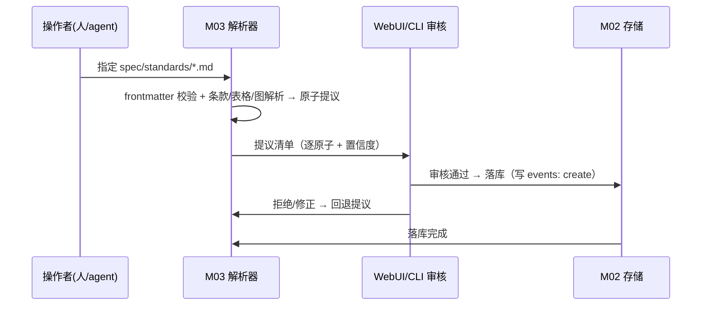
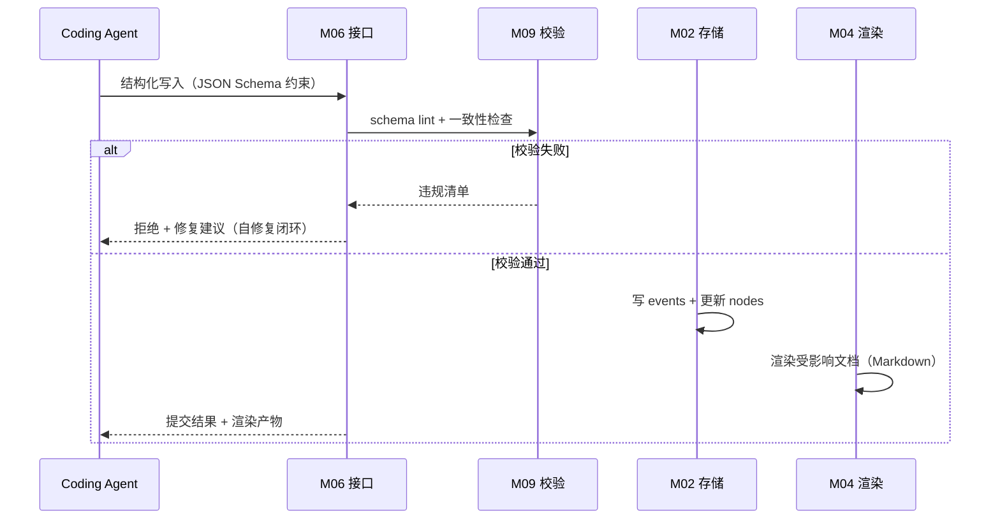
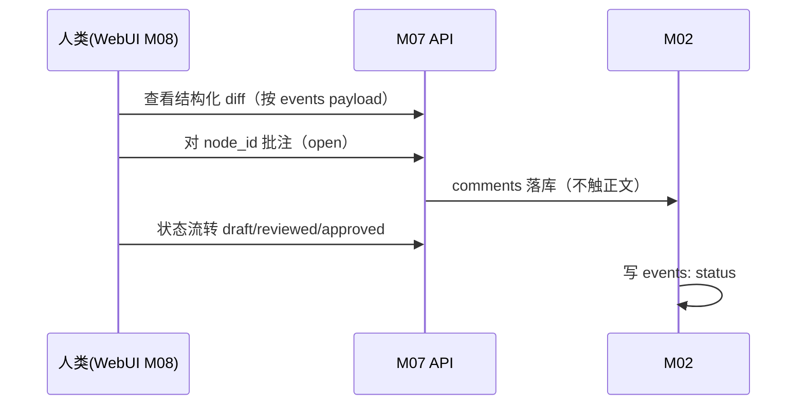
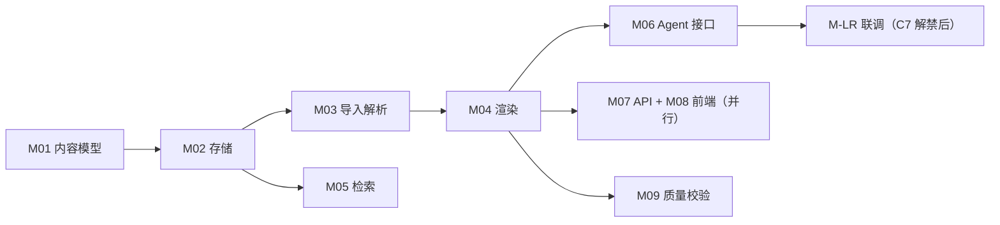

# 芯片设计知识库系统 设计文档

生成：2026-09-16（it.idea 完整模式）。输入：`芯片设计知识库-结构化文档方案-v0.1.md`；假设台账见 `clarifications.md`（B1–B15）；方案对比见 `approach_analysis.md`；决策矩阵见 `trade_off_matrix.md`。

## 1. 概述与目标

为芯片设计全流程文档（需求/架构/验证/后端/工艺/标准/工具手册）建立一套**结构化知识库系统**：以结构化 Schema 为唯一权威源，由确定性渲染层产出人类可读格式，让 coding agent 以结构化方式读写、人类以 WebUI 评审协作，并同时提供确定性引用检索与语义检索。

**问题映射（v0.1 §2 → 本设计）**：

| # | 问题 | 本设计的对策 | 承载模块 |
|---|---|---|---|
| P1 | 格式合规性 | agent 只写结构化字段；渲染由模板确定性产出 | M04/M06 |
| P2 | 跨文档精确引用 | 引用边（`refs`）为数据库关系 + 稳定 ID（UUIDv7 + `<doc>#<锚>` alias） | M01/M02/M05 |
| P3 | 人机协作评审 | 批注独立表（指向 node_id）+ 结构化 diff + 状态流转 | M02/M07/M08 |
| P4 | 检索与多跳推理 | 确定性图查询（refs 多跳）为主 + LightRAG 语义召回补充 | M05/M-LR |
| P5 | 文档异构性 | Schema 注册表 + 共享内容原子（三类文档组合不同原子） | M01 |

**首批试点（B7/C7）**：行业标准 spec 类型；语料 = `spec/standards/` 7 份已审核 markdown（PCIe 5.0/CXL 3.2/HBM4/AMBA×4，≈11.4MB），用作解析→存储→渲染的回归 fixture（B12）。

## 2. 范围

**范围内**：S1–S7（见 `clarifications.md` §1）。
**范围外**（v0.1 §5.1 明示不做）：复杂可配置工作流引擎、多项目多层级组织、内置报表仪表盘、PLM/ALM 双向集成、全自动 PDF 直转。
**部署形态**：单机、单用户、无鉴权（B6），systemd --user（B15）。

## 3. 架构总览

架构模式：**模块化单体**（知识库推荐：单 Agent/中小项目）+ 内部 OpenAPI 契约边界（前后端可并行实现与独立演进）。



## 4. 模块划分（M01–M09）

编号即引用锚（Agent-friendly）；依赖只许向下（后编依赖前编）。

| 模块 | 名称 | 边界（输入 → 输出） | 依赖 |
|---|---|---|---|
| M01 | 内容模型 / Schema 注册表 | schema 定义（原子类型、字段、约束） → 类型化节点结构；文档类型组合规则 | — |
| M02 | 存储层 | 节点/引用/事件/批注的读写操作 → PG 行与查询结果 | M01 |
| M03 | 导入与解析 | markdown 文本（+frontmatter） → 结构化原子**提议**（待审核）→ 入库 | M01, M02, M09 |
| M04 | 渲染引擎 | 结构化节点集 → Markdown 文档（往返一致） | M01, M02 |
| M05 | 检索与追溯 | 查询（ID/关键词/多跳 refs） → 结果集（含 node_id 与来源） | M02 |
| M06 | Agent 接口 | 结构化读写请求（JSON Schema 约束） → 校验/落库/渲染结果；lint 报错回馈 | M01, M02, M04, M09 |
| M07 | WebUI 后端 API | 表单数据/diff/批注/状态/历史请求 → OpenAPI 响应 | M01, M02, M04 |
| M08 | WebUI 前端 | schema + 数据/操作 → 交互界面（表单、diff 视图、批注面板、追溯表） | M07（仅 API 契约） |
| M09 | 质量与一致性校验 | 节点/文档 → 违规清单（schema 违规、断链、术语、渲染一致性） | M01, M02, M04 |
| M-LR | LightRAG 集成边界 | 渲染文本+node_id 导出包 / 增量事件 → 语义索引（**暂缓联调** C7） | M02, M04 |

**依赖图**：



## 5. 数据模型（草案）

**PostgreSQL（database `agenticdocer`，B2）**；JSONB 存节点内容、关系表存图边（v0.1 §9 已定，不引图数据库）。

| 表 | 关键列 | 说明 |
|---|---|---|
| `docs` | `doc_id`(PK, `SPEC-*` 形式), `doc_type`, `title`, `meta`(JSONB, frontmatter 全集), `source_ref`, `status`, `created_at`, `updated_at` | 文档级元数据（C5 字段全集入 `meta`） |
| `nodes` | `node_id`(PK, UUIDv7), `doc_id`(FK), `atom_type`, `ordinal`, `anchor`（章节锚 alias）, `content`(JSONB), `status`, `created_at`, `updated_at` | 内容原子（v0.1 §4.4 八类：`clause`/`definition`/`table`〔+`register_field` 变体〕/`figure`〔+`state_machine`〕/`code`/`example`/`note`/`cross_ref`） |
| `refs` | `src_node_id`, `dst_doc_id`, `dst_node_id`(nullable), `kind`（`traces_to`/`see_also`/`composes_from`/`source_ref`） | 确定性引用图（多跳查询起点） |
| `events` | `event_id`(UUIDv7), `entity`（doc/node/comment）, `entity_id`, `op`（create/update/delete/status）, `payload`(JSONB, 字段级 diff), `actor`（agent/human 标识）, `ts` | append-only 变更日志（v0.1 §3；版本历史与结构化 diff 的来源） |
| `comments` | `comment_id`, `node_id`(FK), `body`, `state`（open/resolved）, `author`, `ts` | 批注独立存储（C3），不侵入节点 content |
| `schemas` | `type_name`, `json_schema`(JSONB), `version` | Schema 注册表（M01 的持久化） |

**ID 方案（B8）**：文档 = `SPEC-*`（沿用既有）；节点 = UUIDv7 主键 + 人类可读 alias `anchor`（如 `SPEC-STD-PCIE-5.0#11.2.3`，由解析器按章节路径生成，冲突时加序号后缀）。

**版本与 diff（S2）**：一切写入走 M06/M07 → 先写 `events`（字段级 diff payload）再更新实体当前态；历史视图 = 事件重放/快照。

## 6. 关键流程

### 6.1 导入流（markdown → 结构化，半自动 B11）



### 6.2 Agent 读写流（S4，P1）



### 6.3 评审流（P3）



### 6.4 检索流（P4）

- 确定性优先：ID 精确定位 → `refs` 逐跳扩展（默认 ≤2 跳）→ 命中集带来源证据（node_id + 文档锚）。
- 语义补充（联调后）：渲染文本喂 LightRAG，命中携带 `node_id` metadata 回查权威记录（v0.1 §6）。
- 两者关系：确定性图 = 精确/可审计；LightRAG 图 = 概率性召回。**正确性始终以结构化库为准**。

## 7. 集成边界

| 边界 | 方式 | 状态 |
|---|---|---|
| GigaRAG → 本系统 | 文件系统：`spec/` 移交（其 03_reviewed → 本库导入，B13） | 已就绪（spec/ 目录与移交流程已建立） |
| 本系统 → LightRAG | 同 PG 实例、同库不同表：LightRAG 用 `LIGHTRAG_*` 表（本地源码核实：lightrag-hku 1.5.6 `kg/postgres_impl.py`/`pgtable_impl.py`，Q1 已解决）；导入以渲染文本 + node_id metadata，增量由 events 驱动 | **暂缓**（C7，用户明令；接口先定义） |
| 渲染导出 | Markdown →（未来）HTML/PDF | Markdown 先行（B9） |

## 8. 技术栈

| 层 | 选型 | 说明 |
|---|---|---|
SKIP
| 存储 | PostgreSQL **16.15**（复用本机 Podman 容器 `pgvector/pgvector:pg16`，:5432；新建 database `agenticdocer`；现有库 mem0/vectest/gigapie_*）+ JSONB | B2 已验证（Q2 已解决） |
| 前端 | React + TypeScript + Vite | B4 |
| 表单引擎 | 候选：RJSF / JSON Forms / 轻量自研 | Q3，Phase 5 ADR |
| 渲染 | Python 模板引擎（候选 Jinja2）或程序化生成 | Q5，Phase 5 ADR |
| 校验 | JSON Schema（节点级）+ 自定义一致性规则；文档格式 lint（markdownlint/remark）可选后置 | v0.1 §5 |
| 测试 | pytest（+httpx TestClient；前端 vitest） | B12；覆盖率 99%（AGENTS.md） |
| 部署 | systemd --user（`agenticdocer-api` 服务；前端静态由 API 托管） | B15 |

## 9. 部署与运维（单机）

```
/开发仓库:  /home/lxx/wrk/AgenticDocer       （spec/ 语料与设计文档、src/ 代码、docs/ 计划）
/运行数据:  PG 实例（复用，database=agenticdocer）
/运行数据:  PG 16.15 容器 pgvector（复用，database=agenticdocer）；本机 /mnt/big10T 不存在，数据落 home 分区
/备份:      git（代码与 spec/ 文档）+ PG dump（数据）——纳入既有 sys-backup 惯例
```

## 10. 测试策略（首批）

| 层 | 方法 | 关键断言 |
|---|---|---|
| 解析器（M03） | 对 7 份语料逐份解析 | frontmatter 全字段保真；条款标题/层级还原；表格行列数还原；零丢失率 ≥ 目标值（解析提议覆盖率、审核通过率量化于 it.test-plan） |
| 存储（M02） | 单元 + 集成（PG） | 事件 append-only；refs 多跳正确；批注不触正文 |
| 渲染（M04） | 往返测试（parse→store→render） | 渲染产物与源 markdown 的语义一致性（结构断言，非字节 diff） |
| Agent 接口（M06） | 契约测试 | 非法 JSON Schema 被拒；lint 自修复闭环成功路径 |
| 端到端 | 7 份语料全链路 + 一次结构化修改 + 一次评审动作 | 全流程可重复执行（B12 语料回归） |

## 11. 风险与未决

| 项 | 风险/问题 | 缓解 |
|---|---|---|
| 解析质量（M03） | 大文件（3.4MB/2.7万行）解析器性能与正确性 | 半自动审核（B11）；分章节增量解析；语料回归常态化 |
| Q2 | PG 实例现状/凭据；node/npm 可用性 | 环境调研回填；缺 node 时前端延后（后端先行） |
| Q3/Q4/Q5 | 表单引擎/节点粒度/模板引擎 | Phase 5 ADR 裁决（对应 arch_spec 的 ADR） |
| 规模上限 | 超 B10 量化值 | 触发再评估（索引/缓存/分区） |
| LightRAG 联调 | 未验证同库多表实际行为 | Q1 已据源码核实；联调前不阻塞（C7） |

## 12. 实施顺序（依赖序，无工期）



1. **地基**：M01（schema 注册表 + 八类原子定义）→ M02（表结构 + 事件日志）
2. **数据入口**：M03（对 7 份语料跑通解析→审核→入库）
3. **出口**：M04（渲染往返）
4. **人机接口**：M06（agent）与 M07/M08（WebUI，API 契约先行）
5. **增值**：M05（多跳检索）、M09（质量门）、M-LR（联调）
