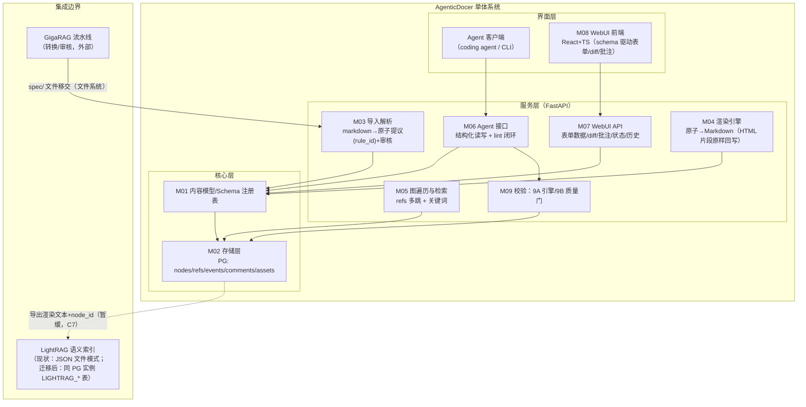
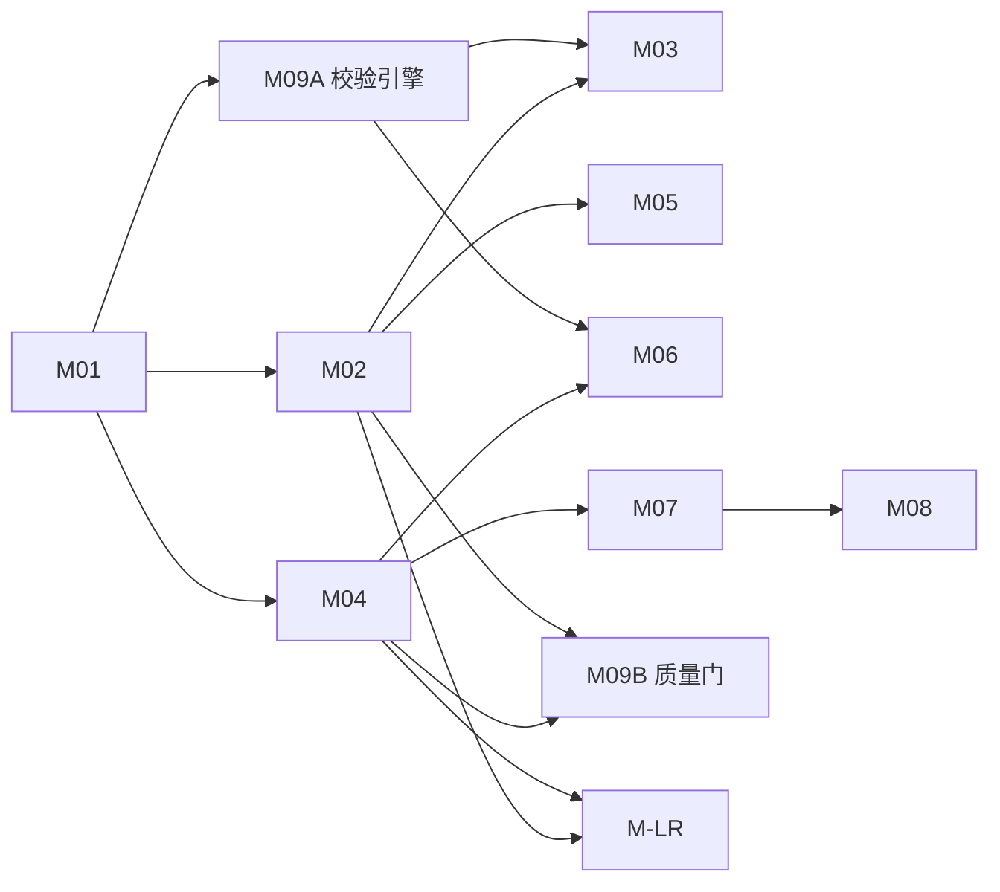
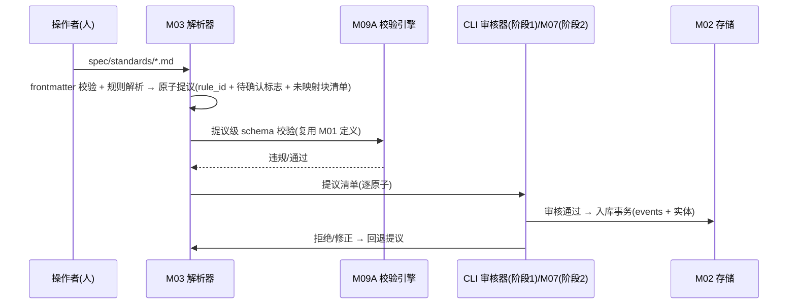
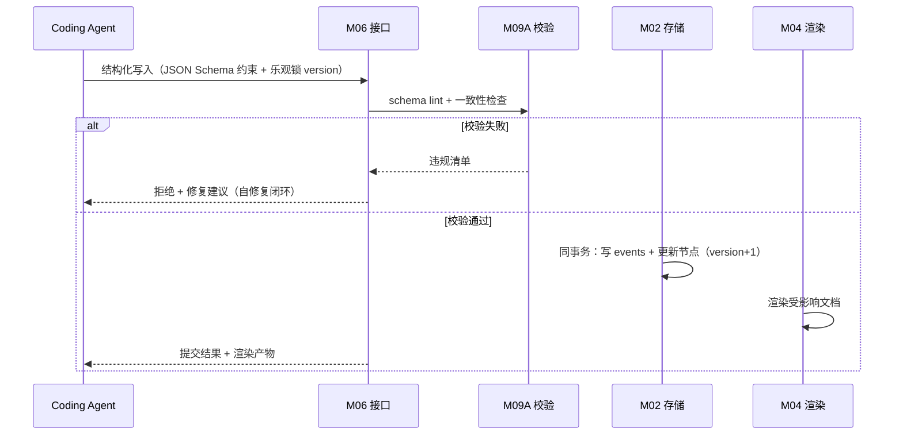
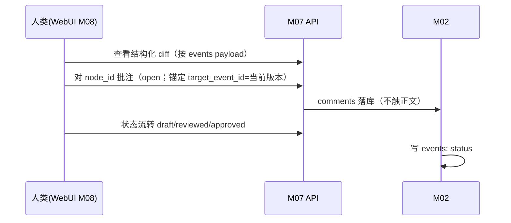
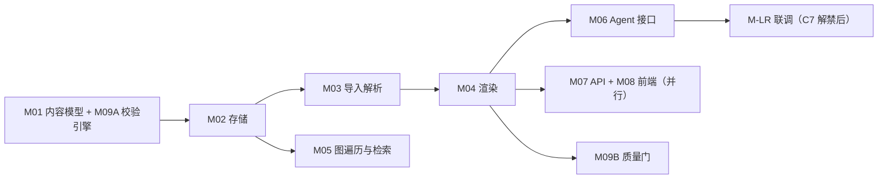

# 芯片设计知识库系统 设计文档

生成：2026-09-16（it.idea 完整模式）。输入：`芯片设计知识库-结构化文档方案-v0.1.md`；假设台账见 `clarifications.md`（B1–B16）；方案对比见 `approach_analysis.md`；决策矩阵见 `trade_off_matrix.md`。

> **v1.1 修订**（2026-09-16，对抗评审 E1–E20 闭环）：HTML 表格/内联标记策略（E1）、资产模型（E2）、refs/schemas 事件覆盖（E3）、M09 两阶段与 M02/M05 边界（E4/E8/E9）、一致性机制（E5）、批注锚定（E6）、层级与锚稳定性（E7）、M03 细化（E10）、渲染产物与唯一入口（E12）、可执行测试判据（E13）、语料实测值（E16）、引用来源修正（E17/E18/E19/E20）。

## 1. 概述与目标

为芯片设计全流程文档（需求/架构/验证/后端/工艺/标准/工具手册）建立一套**结构化知识库系统**：以结构化 Schema 为唯一权威源，由确定性渲染层产出人类可读格式，让 coding agent 以结构化方式读写、人类以 WebUI 评审协作，并同时提供确定性引用检索与语义检索。

**问题映射（v0.1 §2 → 本设计）**：

| # | 问题 | 本设计的对策 | 承载模块 |
|---|---|---|---|
| P1 | 格式合规性 | agent 只写结构化字段；渲染由模板确定性产出（HTML 片段原样回写，见 §5.1） | M04/M06 |
| P2 | 跨文档精确引用 | 引用边（`refs`）为数据库关系 + 稳定 ID（UUIDv7 + 稳定 anchor） | M01/M02/M05 |
| P3 | 人机协作评审 | 批注独立表（指向 node_id + 事件锚）+ 结构化 diff + 状态流转 | M02/M07/M08 |
| P4 | 检索与多跳推理 | 确定性图查询（refs 多跳，语义见 §6.4）为主 + LightRAG 语义召回补充 | M05/M-LR |
| P5 | 文档异构性 | Schema 注册表 + 共享内容原子（三类文档组合不同原子） | M01 |

**首批试点（B7/C7）**：行业标准 spec 类型；语料 = `spec/standards/` 7 份已审核 markdown（PCIe 5.0/CXL 3.2/HBM4/AMBA×4；**实测 8,812,225 B ≈8.8MB、75,694 行**；含 `<table>` 2,440、图片引用 1,019 处——形态事实见 §5.1/§5.2），用作解析→存储→渲染的回归 fixture（B12）。

## 2. 范围

**范围内**：S1–S7（见 `clarifications.md` §1）。
**范围外**：v0.1 §5.1 明示不做的 4 项（复杂工作流引擎、多项目多层级组织、报表仪表盘、PLM/ALM 双向集成）+「全自动 PDF/markdown 直转」（依据：B11 与 GigaRAG README §核心原则「自动解析质量不可控」，非 v0.1 §5.1 条目）。
**延后声明**：v0.1 §9 的「verification plan 对齐 Accellera UCIS / vPlan」适用于 verification 类型，随 B7 逐类型扩展时落地（当前不实现）。
**部署形态**：单机、单用户、无鉴权（B6），systemd --user（B15）。

## 3. 架构总览

架构模式：**模块化单体**（知识库推荐：单 Agent/中小项目）+ 内部 OpenAPI 契约边界（前后端可并行实现与独立演进）。



## 4. 模块划分（M01–M09）

编号即引用锚（Agent-friendly）。依赖原则：**只依赖低编号模块（编号序即实现序，见 §12）**。

| 模块 | 名称 | 边界（输入 → 输出） | 依赖 |
|---|---|---|---|
| M01 | 内容模型 / Schema 注册表 | schema 定义（原子类型、字段、约束） → 类型化节点结构 | — |
| M02 | 存储层 | 节点/引用/事件/批注/资产的**原子 CRUD 与点查** → PG 行与查询结果 | M01 |
| M03 | 导入与解析 | markdown 文本（+frontmatter） → 原子**提议**（带 `rule_id` 与待确认标志）→ **入库前 schema 校验**（复用 M09A 引擎）→ 入库 | M01, M02, M09A |
| M04 | 渲染引擎 | 结构化节点集 → Markdown（HTML 片段/内联标记原样回写；产出 `normalize()` 规范化表示供 M09B 消费） | M01, M02 |
| M05 | 图遍历与检索 | 查询（ID 精确/关键词/**refs 多跳递归**） → 结果集（node_id + 来源证据 + 跳数） | M02 |
| M06 | Agent 接口 | 结构化读写请求（JSON Schema 约束） → 校验/落库/渲染结果；lint 报错回馈 | M01, M02, M04, M09A |
| M07 | WebUI 后端 API | 表单数据/diff/批注/状态/历史请求 → OpenAPI 响应 | M01, M02, M04 |
| M08 | WebUI 前端 | schema + 数据/操作 → 交互界面（表单、diff 视图、批注面板、追溯表） | M07（仅 API 契约） |
| M09 | 校验（**两阶段交付**） | **M09A 校验引擎**（schema 规则库；服务 M03 提议校验与 M06 写入校验——阶段 1 随 M01 交付）；**M09B 质量门**（断链/术语/渲染一致性/events↔当前态一致性巡检——阶段 3） | M01, M02, M04（9B） |
| M-LR | LightRAG 集成边界 | 渲染文本+node_id 导出包 / 增量事件 → 语义索引（**暂缓联调** C7） | M02, M04 |

**边界细则（消歧）**：M02 = 原子 CRUD + 单点/集合点查，**不含**图遍历与检索语义；M05 = 递归 CTE 多跳与关键词检索的全部语义（§6.4）；M04 = 渲染唯一执行者，M09B 消费其 `normalize()` 结果做一致性判定（不重复计算）。

**依赖图**：



## 5. 数据模型（草案）

**PostgreSQL（database `agenticdocer`，B2）**；JSONB 存节点内容、关系表存图边（v0.1 §9 已定，不引图数据库）。

| 表 | 关键列 | 说明 |
|---|---|---|
| `docs` | `doc_id`(PK, `SPEC-*`), `doc_type`, `title`, `meta`(JSONB), `source_ref`, `status`, `version`(乐观锁), `created_at`, `updated_at` | 文档级元数据（C5 字段全集入 `meta`） |
| `nodes` | `node_id`(PK, UUIDv7), `doc_id`(FK), `atom_type`, `format`（`md`/`html`/`text`）, `ordinal`, `parent_node_id`(自引用), `level`, `anchor`, `content`(JSONB), `status`, `version`(乐观锁), `created_at`, `updated_at` | 内容原子（八类 §5.1） |
| `refs` | `src_node_id`, `dst_doc_id`, `dst_node_id`(nullable), `kind`（`traces_to`/`see_also`/`composes_from`/`source_ref`） | 确定性引用图（多跳遍历见 §6.4；**变更事件见 §5.3**） |
| `events` | `event_id`(UUIDv7), `entity`（**`doc`/`node`/`ref`/`comment`/`schema`**）, `entity_id`, `op`（create/update/delete/status）, `payload`(JSONB, 字段级 diff), `actor`, `ts` | append-only 变更日志（v0.1 §3） |
| `comments` | `comment_id`, `node_id`(FK), `target_event_id`（锚定创建时节点版本，E6）, `body`, `state`（`open`/`resolved`/`orphaned`）, `author`, `ts` | 批注独立存储（C3） |
| `schemas` | `type_name`, `json_schema`(JSONB), `version` | Schema 注册表；**doc_type 组合规则**（`doc_type → 允许原子类型/必填字段`）随首个非 `standard` 类型引入时定义（Q6） |
| `assets` | `asset_id`(PK, sha256), `mime`, `bytes`, `origin`（如 GigaRAG `corpus/02_converted/.../auto/images/`）, `path` | 内容寻址资产存储（E2）；`figure.content.asset_ref` → `asset_id` |

### 5.1 内容原子与格式策略（E1）

八类原子（v0.1 §4.4）：`clause`/`definition`/`table`〔+`register_field` 变体〕/`figure`〔+`state_machine`〕/`code`/`example`/`note`/`cross_ref`。

**HTML 事实**（语料实测）：表格 100% 为 HTML 标记（`<table>` 2,440 / `<tr>` 19,763 / `<td>` 79,817，57,005 个单元格带 `colspan/rowspan/bgcolor/align`）；含 `<sup>/<br>` 等内联标记 239+ 行。

**策略（选定 E1-a）**：
- `table` 原子：`format: "html"`，`content.fragment` = **原样 HTML 片段**；另存结构元数据 `content.meta = {rows, cols, cells, max_colspan}`（解析器统计）供 M09B 断言。
- 其余原子中的内联标记：随其 `format`（`md`/`text`）原样保留文本。
- M04 渲染：`format:html` 片段**原样回写**（零改写）；M06 结构化写入若提交 HTML 片段，M09A 仅校验片段语法闭合与元数据一致性。
- 禁止对 HTML 片段做「结构化拆解再还原」（E1-b 被否决：属性/嵌套标记无处安放，且引入改写风险）。

### 5.2 资产模型与图片（E2）

- 语料含 `images/<sha256>.jpg` 引用 1,019 处；**实物不在本仓库**——位于 GigaRAG `corpus/02_converted/specifications/*/auto/images/`。
- 导入（M03）时：按引用路径到上述目录取件，`sha256` 校验后写入 `assets`（内容寻址），`figure.content.asset_ref` 指向 `asset_id`。
- 缺失资产（GigaRAG 目录中不存在）：**不阻断导入**——记录为 `assets.missing` 违规项（M09B），渲染时保留原引用路径并在产物中标注。
- M04 渲染产物中，图片相对路径重写规则见 §7。

### 5.3 一致性机制（E3/E5）

- **事件覆盖**：文档/节点/引用边/批注/schema 的全部变更均产生 `events` 行（`entity` 枚举 §5 表）。`ref` 事件 payload 含 `{op: add|remove, src, dst, kind}`；M-LR 增量消费此流。
- **事务边界**：`events` 写入与实体当前态更新**同一事务**提交（成功则全有，失败则回滚，无撕裂状态）。
- **并发**：`docs`/`nodes`/`comments` 带 `version` 列做**乐观锁**——写入请求携带读到版本，不匹配返回 `409 可重试`（M06/M07 处理）。
- **快照**：不建快照表（规模 ≤10^5 节点，事件重放足够）；版本历史 = 事件重放视图。
- **一致性巡检**：M09B 提供「events 重放结果 ↔ 当前态」差异检查（启动期抽查 + 按需全量），差异列入违规清单。
- **schema 复审口径（E9）**：节点不绑定 schema 版本；lint 与渲染一律按**当前** schema 复审（C6 演进策略下最简自洽）。
- **术语校验数据源（E9）**：`terms` 词汇表（glossary 表，随 M09B 引入）——收 glossary 条目与规范性关键词清单（SHALL/SHOULD/MAY/MUST，v0.1 §4.2 RFC2119 风格）；M09B 术语违规 = 违规使用或未定义关键词。

### 5.4 ID 与锚（E7）

- 文档 ID：`SPEC-*`（沿用既有）；节点主键：UUIDv7。
- `anchor`（人类可读 alias）：`<doc_id>#<章节号路径>`，如 `SPEC-STD-PCIE-5.0#11.2.3`；**重复标题**（实测 CXL「Test Steps:」219 次等）以「章节号 + 标题内容 sha256 前 8 位」消歧；**无编号标题**（如「Chapter A2」「Part C Glossary」）用「标题 slug + 哈希」。
- 稳定性承诺：anchor 构造**与插入位置无关**（不含序号后缀漂移）；源文档改版重解析时按 anchor 匹配 + 变更清单人工确认迁移（迁移规则由 M03 实现）。
- 层级：`parent_node_id` + `level` 显式建模（渲染层级还原的数据依据）。

## 6. 关键流程

### 6.1 导入流（markdown → 结构化，半自动 B11/E10）



- **无概率置信度**（解析器是确定性规则）：提议携带 `rule_id`（命中规则标识）与 `待确认` 标志（规则未覆盖的启发式解析）；人工仅需复核「待确认」项与未映射清单。
- **未映射内容兜底**：无法映射到八类原子的块（目录/许可/免责声明/残余 HTML 等）→ 降级为 `note`/`code`（`format:html`）原子保留，计入「解析提议覆盖率」分母（§10），**不丢弃**。
- 审核载体：阶段 1 = CLI（`python -m agenticdocer.import review`，实现于 it.mas/it.tdd 细化）；阶段 2 = M07 API（WebUI 表单）。

### 6.2 Agent 读写流（S4，P1）



### 6.3 评审流（P3/E6）



- 批注锚定创建时的节点版本（`target_event_id`）；版本历史视图中，批注显示在其锚定版本旁。
- 节点删除（`events.op=delete`）→ 批注**保留**并置 `state=orphaned`（不级联删除），界面标注「原文已删除」。

### 6.4 检索流（P4/E8）

**确定性多跳（M05，SQL 递归 CTE）**：

| `refs.kind` | 遍历方向 | 参与跳数 | 说明 |
|---|---|---|---|
| `traces_to` | 上游（dst→src 追溯） | 默认 1 跳，可扩 2 跳 | 需求追溯主链 |
| `composes_from` | 下游（src→dst 组成） | 1 跳 | 文法/组合关系 |
| `see_also` | 双向 | 1 跳 | 相关参考 |
| `source_ref` | 不参与多跳 | 0 | 叶引用（指向外部 PDF 等） |

- 跳数语义：查询参数 `hops`（默认 1，上限 2）；**节点集去重**保留最短路径；**环**以访问集截断；**排序**：跳数升序 → 文档序 → `ordinal`；结果含证据链（路径上的 refs）。
- 关键词检索：PostgreSQL 全文检索（`tsvector`，english 配置起步）+ `pg_trgm` 备选（选型入 ADR）；索引：`nodes.content` GIN（jsonb_path_ops）+ anchor 唯一索引 + refs 双列索引。

## 7. 集成边界

| 边界 | 方式 | 状态 |
|---|---|---|
| GigaRAG → 本系统 | 文件系统：`spec/` 移交（B13）；图片资产从 `corpus/02_converted/specifications/*/auto/images/` 按需取件（§5.2） | 已就绪 |
| 本系统 → LightRAG | **迁移前置条件**：lightRAG 当前为 JSON 文件模式（`/home/lxx/lightrag/rag_storage`），需先迁移至 PG 后端（LIGHTRAG_* 表，Q1 已核实代码能力）并定义重建/双写策略；导入以渲染文本 + node_id metadata，增量由 events 驱动 | **暂缓**（C7） |
| 渲染产物 | 输出目录 `build/rendered/`（**不在 spec/ 内、不被 ingest 扫描**；gitignore）；图片以相对路径指向资产导出目录 `build/rendered/assets/`（从 `assets` 表导出，§5.2） | 本设计定义 |
| 入库唯一入口 | C7 解禁后：**一次性初始导入**用 `spec/standards/` 快照（经 M03）；此后**增量只走 events→M-LR 通道**；`ingest.sh` 对 `spec/` 的递归扫描不作为日常入口（避免与 M-LR 形成双入口/重复入库） | 本设计定义 |

## 8. 技术栈

| 层 | 选型 | 说明 |
|---|---|---|
| 语言/后端 | Python 3.11+（**uv 管理**；系统 python3=3.6.8 不可用）/ FastAPI / SQLAlchemy 2.x 异步（asyncpg） | B5；OpenAPI 契约原生 |
| 存储 | PostgreSQL **16.15**（复用本机 Podman 容器 `pgvector/pgvector:pg16`，:5432；新建 database `agenticdocer`；现有库 mem0/vectest/gigapie_*）+ JSONB | B2 已验证（Q2 已解决） |
| 前端 | React + TypeScript + Vite | B4 |
| 表单引擎 | 候选：RJSF / JSON Forms / 轻量自研 | Q3，ADR |
| 渲染 | Python 模板引擎（候选 Jinja2）或程序化生成；HTML 片段直通 | Q5，ADR |
| 校验 | JSON Schema（M09A）+ 一致性规则（M09B）；文档格式 lint 可选后置 | v0.1 §5 |
| 文本检索 | PG FTS（tsvector）+ pg_trgm 备选 | §6.4；ADR |
| 测试 | pytest（+httpx TestClient；前端 vitest） | B12；覆盖率 99%（AGENTS.md） |
| 部署 | systemd --user（`agenticdocer-api` 服务；前端静态由 API 托管） | B15 |

## 9. 部署与运维（单机）

```
/开发仓库:  /home/lxx/wrk/AgenticDocer       （spec/ 语料+设计+计划归档、src/ 代码、tests/、scripts/）
/渲染产物:  build/rendered/（派生数据，gitignore；含 assets/ 导出）
/运行数据:  PG 16.15 容器 pgvector（复用，database=agenticdocer）；本机 /mnt/big10T 不存在，数据落 home 分区
/服务:      systemd --user: agenticdocer-api（127.0.0.1，端口待实现期定）
/备份:      git（代码与 spec/ 文档）+ PG dump（数据）——纳入既有 sys-backup 惯例
```

> 说明：原 `docs/plans/` 目录已废弃（计划文档归档至 `spec/idea/plan-spec-central-directory.md`）。

## 10. 测试策略（首批，E13 可执行判据）

**规范化表示 `normalize(doc)`**（往返一致性判定的可比对口径）：标题序列（层级+文本）、表格（行列数 + 单元格文本按行列序）、代码块（内容）、图片引用集合、列表结构（嵌套层次）、内联标记保真集（`<sup>/<br>` 等原样出现）。

| 层 | 方法 | 可执行断言 |
|---|---|---|
| 解析器（M03） | 对 7 份语料逐份解析 | **解析提议覆盖率 = 被原子承接的源块数 ÷ 总源块数**（源块 = 标题/表格/图/代码块/列表/段落），阶段 1 目标 **≥95%**；规则未覆盖块全部进入「待确认」清单且 100% 有兜底原子（§6.1），无静默丢弃 |
| 存储（M02） | 单元 + 集成（PG） | events append-only（无 UPDATE/DELETE 语句路径）；同事务性（注入失败断言无撕裂）；乐观锁冲突返回 409；refs 多跳与 §6.4 语义一致；批注不触 `nodes.content` |
| 渲染（M04） | 往返测试（parse→store→render） | `normalize(render(store(parse(src)))) == normalize(src)`（§10 定义），逐文档通过；HTML 表格行列数与单元格文本保真（E1）；图片引用集一致（E2） |
| Agent 接口（M06） | 契约测试 | 非法 JSON Schema 被拒；乐观锁冲突可重试；lint 自修复闭环成功路径 |
| 批注与事件（M07） | 集成 | 批注生命周期（open→resolved；节点删除→orphaned）；事件重放 = 当前态（M09B 巡检一致） |
| 端到端 | 7 份语料全链路 + 结构化修改 + 评审动作 + 断链注入 | 全流程可重复执行（B12）；断链注入被 M09B 检出 |

## 11. 风险与未决

| 项 | 风险/问题 | 缓解 |
|---|---|---|
| 解析质量（M03） | 大文件（3.4MB/2.7 万行）性能与正确性 | 半自动审核（B11）；分章增量解析；语料回归常态化；覆盖率断言（§10） |
| 锚稳定性（E7） | 源文档改版后 anchor 匹配漂移 | 构造与位置无关 + 重解析人工确认迁移；UUID 主键为真相（anchor 仅 alias） |
| GigaRAG ingest 路径漂移 | ingest.sh 默认 `LIGHTRAG_INPUT_DIR=/mnt/big10T/...`，本机实际为 `/home/lxx/lightrag/inputs`（/mnt/big10T 不存在） | 恢复摄入（C7 解禁）前以环境变量覆盖并实测；已在 summary.md 记录 |
| Q3/Q4/Q5/Q6 | 表单引擎/节点粒度/模板引擎/doc_type 组合规则 | ADR 与试点裁决（Q6 随首个非 standard 类型） |
| 规模上限 | 超 B10 量化值 | 触发再评估（索引/缓存/分区） |
| LightRAG 迁移 | JSON→PG 迁移与重建策略未定 | 联调前完成（C7 解禁前置条件，§7） |

## 12. 实施顺序（依赖序，无工期）



1. **地基**：M01（schema 注册表 + 八类原子定义）与 M09A（校验规则库，随 M01 交付）→ M02（表结构 + 事件日志 + 乐观锁）
2. **数据入口**：M03（7 份语料解析→审核→入库；CLI 审核器先行）
3. **出口**：M04（渲染往返，HTML 片段直通）
4. **人机接口**：M06（agent）与 M07/M08（WebUI，API 契约先行，可并行）
5. **增值**：M05（多跳检索）、M09B（质量门）、M-LR（联调，前置=LightRAG 存储迁移）
